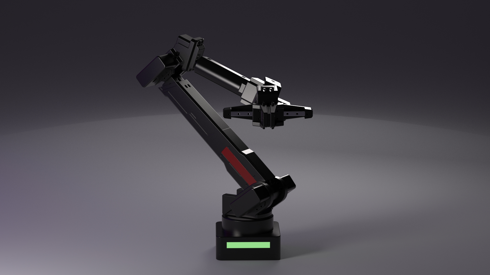
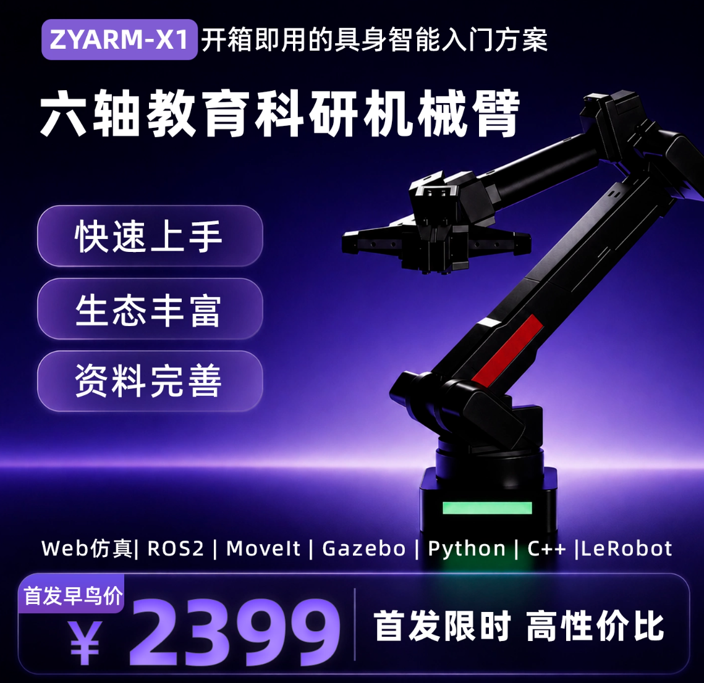

# ZYArm-X1



ZYArm-X1 是一台面向教学、创客项目、比赛任务和具身智能实验的 6+1 轴桌面机械臂。本仓库是它配套的开放工程仓库，覆盖固件、串口协议、SDK、Web 可视化、ROS 2、MoveIt、Gazebo、LeRobot、示例程序、诊断工具和系统化文档。

它既不是只停留在演示层的封闭玩具，也不是一开始就要求你配置复杂机器人栈的科研平台。你可以从最小串口命令开始，让真实机械臂安全动起来；再逐步进入 Python/C++ SDK、Web 控制与仿真、ROS 2 运动规划、LeRobot 遥操、数据采集、回放和策略评估。

> 命名说明：当前文档面向 `ZYArm-X1` 编写；ROS 2 模型资源统一使用 `x1_standard` 命名。

## 项目亮点

- 真实 6+1 轴硬件：六个机械臂关节加一个夹爪自由度，适合讲解关节控制、夹爪控制、运动学、轨迹执行和遥操。
- 渐进学习路线：第一次上手只需要跑通串口状态读取和小幅动作，后续再进入 SDK、Web、ROS 2、MoveIt、Gazebo 或 LeRobot。
- 多层软件接入：仓库包含 STM32 固件、Python/C++ SDK、Web 控制端、ROS 2 工作区、LeRobot 适配、示例程序和诊断脚本。
- 可演示项目场景：支持动作录制与回放、手柄遥操、主从臂遥操、Web 仿真、摄像头抓取和桌面分拣等玩法。
- 面向科研实验：提供 LeRobot 路线，用于遥操验证、数据集录制、数据集回放、数据质量检查和策略评估。

## 能力地图

| 方向 | 可以做什么 | 推荐入口 |
| --- | --- | --- |
| 最小真机闭环 | 上电、连接串口、读取状态、执行一次安全小幅动作 | [快速上手](docs/02_快速上手/README.md) |
| 基础控制 | 复位、停止、关节控制、夹爪控制、速度设置、状态读取和运动学逆解 | [基础操作](docs/04_基础操作/README.md) |
| 项目玩法 | Web 仿真、动作录制、手柄遥操、主从臂遥操、视觉抓取和桌面分拣 | [常用玩法与项目案例](docs/05_常用玩法/README.md) |
| 框架接入 | Serial API、Python SDK、C++ SDK、Web、ROS 2、MoveIt 和 Gazebo | [仿真与框架接入](docs/06_仿真与框架接入/README.md) |
| 科研与数据采集 | LeRobot 遥操、record 数据采集、replay 回放、policy eval 和数据质量检查 | [科研与数据采集](docs/07_科研与数据采集/README.md) |
| 二次开发 | 修改固件协议、扩展 SDK、维护 ROS 2 包、开发 Web 控制端和新增工具 | [开发者指南](docs/09_开发者指南/README.md) |

## 按目标进入

| 我是谁 | 建议先看 | 目标 |
| --- | --- | --- |
| 第一次接触机械臂的学习者 | [快速上手](docs/02_快速上手/README.md) | 先跑通真实机械臂的最小闭环 |
| 创客或比赛用户 | [常用玩法与项目案例](docs/05_常用玩法/README.md) | 体验遥操、录制、Web 仿真、抓取和桌面任务 |
| 教师或课程维护者 | [产品简介](docs/01_产品简介/README.md) | 组织串口控制、运动学、仿真和数据采集课程 |
| 科研用户 | [科研与数据采集](docs/07_科研与数据采集/README.md) | 跑通 LeRobot 遥操、数据采集、回放和策略评估 |
| 二次开发者 | [开发者指南](docs/09_开发者指南/README.md) | 理解固件、协议、SDK、ROS 2、Web、LeRobot 和工具边界 |
| 遇到问题的用户 | [校准维护与排障](docs/08_校准维护与排障/README.md) | 排查连接、动作、环境、Web、ROS 2 和 LeRobot 问题 |

## 快速开始

第一次使用建议先完成一次低风险真机闭环，再按目标进入更复杂的框架或项目：

```text
产品简介
  -> 快速上手
  -> 基础操作
  -> 常用玩法 / 仿真与框架接入 / 科研与数据采集
```

- 第一次使用机械臂：阅读 [docs/02_快速上手](docs/02_快速上手/README.md)
- 查看完整文档体系：阅读 [docs/README.md](docs/README.md)
- 准备 Windows、Ubuntu、Python、Web、ROS 2 或 LeRobot 环境：阅读 [docs/03_安装与准备](docs/03_安装与准备/README.md)
- 不熟悉工具和术语：阅读 [docs/术语与工具速查.md](docs/术语与工具速查.md)

## 购买



如需购买 ZYArm-X1，可前往淘宝商品页查看配置、价格与库存信息：[打开淘宝购买链接](https://item.taobao.com/item.htm?id=1050339940941)。

## 目录结构

```text
ZYArm-X1/
├── docs/          # 面向学习者、客户、教师、科研和二开的使用文档
├── firmware/      # STM32 固件工程，内部保持 Keil/STM32Cube 项目结构
├── web/           # Web 控制端工程，内部保持前端项目结构
├── hardware/      # 硬件参考资料和配置文件
├── software/      # 上位机侧 SDK、ROS 2、LeRobot、示例、诊断和工具
├── data/          # 学习数据、运行日志等本地数据
└── openspec/      # 架构和功能变更规格
```

## 维护边界

- `docs/` 是用户学习路径，优先帮助学习者快速跑通真实机械臂。
- `firmware/` 和 `web/` 是主要项目，只在根目录统一小写，内部结构不做目录整理。
- `software/` 放上位机侧代码，包括 ROS 2、SDK、LeRobot、示例和工具。
- `data/learning/` 用于学习数据，`data/logs/` 用于运行日志；这些目录默认不作为源码提交。

## 开源协议与商标

ZYArm-X1 采用分层授权策略：

- 大部分软件、SDK、ROS 2、Web、示例、工具和 URDF 运动学资源使用 Apache-2.0。
- 原创固件核心使用 MPL-2.0。
- 文档和脱敏后的公开 mesh 资产使用 CC BY-SA 4.0。
- 生产 CAD、高精生产 mesh、BOM、工艺、工厂标定、质检资料和私有密钥不属于公开授权范围。
- `ZYArm`、`ZYArm-X1`、Logo 和相关品牌资产保留商标和品牌权利。

标准许可证正文保留官方文本，项目边界说明使用中文。完整说明见 [LICENSE.md](LICENSE.md)、[NOTICE.md](NOTICE.md)、[TRADEMARKS.md](TRADEMARKS.md)、[CONTRIBUTING.md](CONTRIBUTING.md) 和 [LICENSES/README.md](LICENSES/README.md)。
