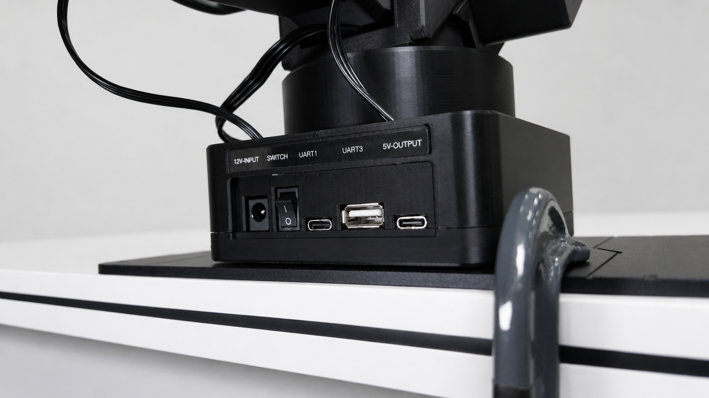

# 硬件组成

本页用于说明机械臂套件的实物组成、接口、尺寸、供电和配件。已经确认的资料会直接写入表格；仍需项目方补充的实物照片、规格边界和批次差异会保留在对应位置。

## 硬件概览

| 项目 | 当前说明 | 备注 |
| --- | --- | --- |
| 自由度 | 6 个机械臂关节 + 1 个夹爪自由度 | 标准 6+1 轴形态 |
| 当前目标型号 | `ZYArm-X1` | ROS 2 模型资源使用 `x1_standard` 命名 |
| 控制板 | STM32 固件工程位于 `firmware/` | 支持串口指令、状态读取和动作控制 |
| 上位机连接 | USB 串口 | 快速上手默认使用 `UART1` |
| 摄像头 | 支持快速拆装 | 用于视觉抓取、遥操观察和数据采集 |

## 机械臂本体

ZYArmV1 / `ZYArm-X1` 目标形态为桌面 6+1 轴机械臂，包含六个机械臂关节和一个夹爪自由度。

## 控制板和接口

| 标注 | 用途 | 使用说明 |
| --- | --- | --- |
| `12V-INPUT` | 12V 电源输入接口 | 连接配套电源适配器 |
| `SWITCH` | 电源开关 | 上电前先确认开关处于关闭状态 |
| `UART1` | 机械臂与电脑通信的串口 | 用于发送固件指令，也用于固件烧录 |
| `UART3` | 预留对外串口 | 当前固件未使用，可通过修改固件进行扩展 |
| `5V-OUTPUT` | 5V 输出接口 | 输出能力为 5V / 2A，用于外设供电前请确认负载电流 |

## 供电规格

| 参数 | 数值 | 备注 |
| --- | --- | --- |
| 推荐输入电压 | 12V |  |
| 推荐电源电流 | 5A |  |
| 典型功耗 | 18W |  |
| 峰值功耗 | 60W |  |
| 电源接口 | DC 5.5 | |

## 尺寸与重量

| 参数 | 数值 | 备注 |
| --- | --- | --- |
| 整机尺寸 | 400mm x 140mm x 187mm | 长 x 宽 x 高 |
| 底座尺寸 | 105mm x 105mm |  |
| 整机重量 | 2kg |  |
| 有效负载 | 500g |  |
| 最大臂展 | 645mm |  |
| 夹爪开合范围 | 65mm |  |

## 摄像头与支架

项目方向支持摄像头快速拆装，用于视觉抓取、数据采集和桌面任务。

> 后续可补充推荐摄像头型号、安装位置照片、腕部摄像头/前置摄像头示例、支架尺寸和接线方式。

## 包装清单

| 物料 | 数量 | 是否标配 | 备注 |
| --- | ---: | --- | --- |
| 机械臂本体 | 1 | 是 |  |
| 控制板 | 1 | 是 | 已安装至机械臂本体 |
| 电源适配器 | 1 | 是 |  |
| USB 串口线 | 1 | 是 |  |
| 金属底座 | 1 | 是 |  |
| 安装工具 | 1 | 是 |  |
| 摄像头 | 可选 | 可选 | 模仿学习通常需要多视角数据采集 |
| 摄像头支架 | 可选 | 可选 |  |
