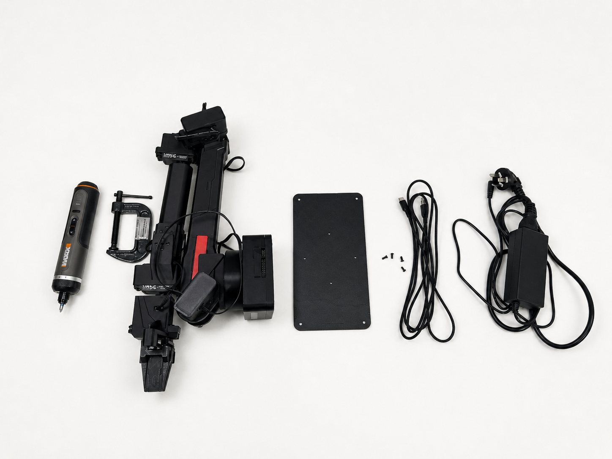
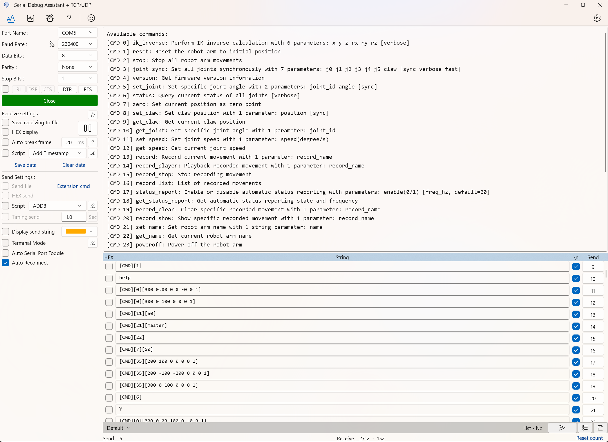
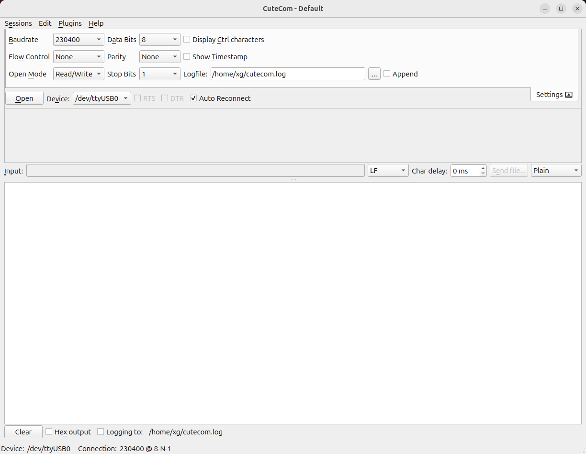

# 你需要准备什么

本章默认走官方在线 Web 控制台路线。它省掉的是手动输入串口命令，不省掉硬件连接、驱动、浏览器权限和安全检查。

## 必备

- ZYArmV1 / `ZYArm-X1` 机械臂本体。
- 已安装在机械臂上的控制板，并刷入与当前仓库匹配的固件。
- 配套电源，优先使用套件内电源。
- USB 串口线，或确认支持数据传输的 USB 线。
- 一台电脑，Windows / Ubuntu / macOS 均可；Windows 用户更需要关注 CH340 驱动。
- Chrome 或 Edge 浏览器，用于 Web Serial 连接本地串口。
- 可以访问官方 Web 控制台的网络环境。
- 金属底板、固定螺丝和桌面固定夹具。
- 螺丝刀或电动螺丝刀。
- 可以快速切断机械臂电源的方式。



上图用于快速核对上手前需要准备的核心物品。不同批次套件可能会有配件差异，以实际发货清单为准。

## 官方 Web 路线需要什么

打开官方 Web 控制台：

```text
https://arm.zyairobot.com/#/zy
```

使用这条路线时，你需要确认：

| 项目 | 要求 | 为什么重要 |
| --- | --- | --- |
| 浏览器 | 推荐 Chrome 或 Edge | Web Serial 在这些浏览器中支持最好 |
| 页面地址 | 使用 `https://arm.zyairobot.com/#/zy` | Web Serial 需要安全页面，且这是已确认官方入口 |
| USB 线 | 必须支持数据传输 | 只能充电的线无法让电脑识别串口 |
| 串口驱动 | Windows 可能需要 CH340 驱动 | 没有驱动时浏览器和串口工具都看不到机械臂 |
| 串口占用 | 关闭串口助手、Keil 或其他占用程序 | 同一时刻串口只能被一个程序打开 |
| 机械臂电源 | 真机动作前必须上电 | 页面能打开不代表机械臂已经可控 |
| 安全空间 | 夹爪和连杆周围保持空旷 | 真实动作会驱动机械臂运动 |

官方 Web 页面可以在线打开。如果你只是第一次让机械臂动起来，只需要使用官网在线入口。

## CH340 驱动

控制板常用 CH340 USB 转串口芯片。Ubuntu 通常已经包含对应驱动；Windows 如果设备管理器里没有出现 `USB-SERIAL CH340` 或类似 `COMx` 端口，请先安装 CH340 驱动。

驱动下载地址：[WCH CH341SER 驱动](https://www.wch.cn/downloads/CH341SER_EXE.html)。

驱动安装成功后，浏览器的串口选择弹窗和串口工具才有可能看到机械臂端口。

## 串口工具作为备用

官方 Web 是推荐主路径，但建议准备一个串口调试工具。它用于官方 Web 不可用、浏览器不支持 Web Serial、连接失败或需要查看底层 ACK 时排障。

串口工具需要支持：

- 选择串口号，例如 Windows `COM3` 或 Ubuntu `/dev/ttyUSB0`。
- 设置波特率为 `230400`。
- 使用 `8N1`，也就是 8 数据位、无校验、1 停止位。
- 不启用流控。
- 以文本方式发送命令，不使用十六进制发送。
- 发送命令时追加回车或换行。
- 能看到机械臂返回的 `[STATUS]`、`ACK`、`ERROR` 等文本内容。

### Windows

Windows 可以使用 [Serial Debug Assistant + TCP/UDP](https://apps.microsoft.com/detail/9nblggh43hdm?launch=true&hl=zh-cn&gl=cn)。后续串口备用路线截图以这个工具为例。



### Ubuntu

Ubuntu 可以使用 CuteCom：

```bash
sudo apt-get update
sudo apt-get install cutecom
cutecom
```



图中 `/dev/ttyUSB0` 只是示例，请替换成你电脑上实际出现的设备名。关键参数需要保持为 `230400`、`8` 数据位、`None` 校验、`1` 停止位，输入模式使用普通文本，不要勾选十六进制输出。

如果当前用户没有串口权限，可以临时使用 `sudo cutecom` 验证；长期使用建议按 [连接电脑并找到串口](03_连接电脑并找到串口.md) 中的说明处理串口权限。

## 串口备用路线会用到的固件命令

| 命令 | 作用 |
| --- | --- |
| `[CMD][6]` | 查询当前状态 |
| `[CMD][1]` | 复位到初始姿态 |
| `[CMD][0][200 0 0 0 0 0]` | 发送一次 IK 小动作 |
| `[CMD][3][J0 J1 J2 J3 J4 J5 CLAW]` | 复现刚刚记录的状态 |
| `[CMD][2]` | 指令急停，串口已连通且来得及时使用；异常时优先直接断电 |

第一次走官方 Web 路线时不需要主动输入这些命令。它们放在这里，是为了让你知道 Web 页面背后仍然在和固件串口通信，也方便后续排障。

## 本章不要求

- 不要求安装 Python。
- 不要求安装 Python SDK。
- 不要求安装 ROS 2。
- 不要求安装 MoveIt。
- 不要求安装 Gazebo。
- 不要求安装 LeRobot。
这些内容都属于后续路线。先用官方 Web 控制台跑通真实机械臂，会更容易建立信心；遇到连接或状态问题时，再切换到串口工具确认硬件、串口和固件链路。
