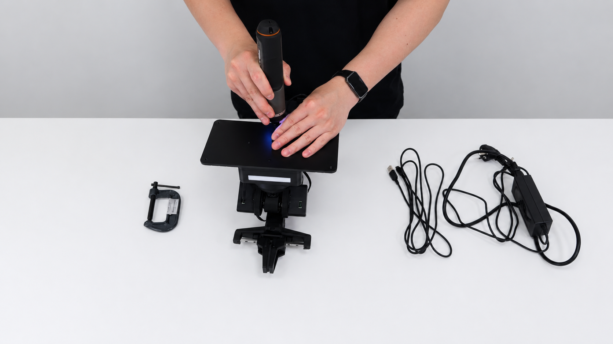
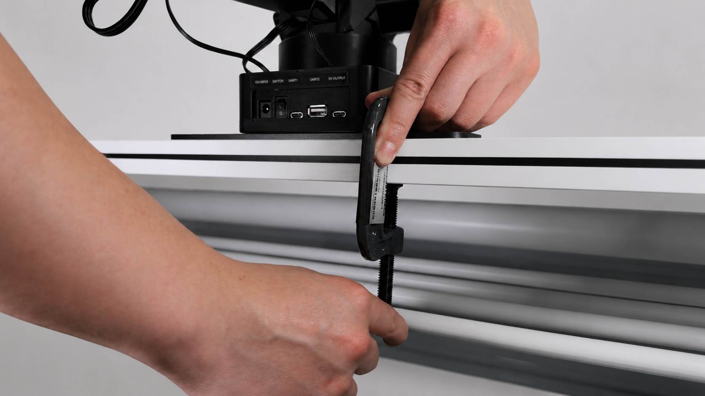

# 确认硬件状态

开始前先做硬件检查。快速上手会让机械臂真实运动，请先确认环境安全。

本页不是完整装配教程，只用于确认机械臂已经具备安全上电和执行小动作的基础条件。

## 检查清单

- 机械臂已经安装到底板上，固定螺丝已拧紧。
- 底板放在稳定桌面上，并按推荐方式用工字架或固定夹具固定。
- 控制板已经刷入与当前仓库匹配的固件。
- 机械臂周围留出足够空间，夹爪和连杆运动范围内没有障碍物。

电源、USB 数据线、官方 Web 连接和串口备用参数会在下一页确认；这里先确认机械臂本体固定可靠，周围空间足够。

上图用于确认机械臂底座已经与金属底板固定牢靠，螺丝没有明显松动。

上图用于确认底板已经固定到桌面，避免机械臂运动时底座滑动或倾倒。

后续连接和上电时，请按 [连接电脑并找到串口](03_连接电脑并找到串口.md) 中的顺序操作。上电后如果状态指示灯为绿色，表示机械臂状态正确；如果状态指示灯为红色，不要继续发送动作命令，请先关闭电源并检查供电、线材、姿态和周围环境。

## 不建议继续的情况

- 底板或固定夹具没有固定牢靠。
- 机械臂周围有障碍物。
- 关节或夹爪被外物卡住。

如果出现这些情况，先处理固定和空间问题，再继续连接电脑、上电和发送命令。
