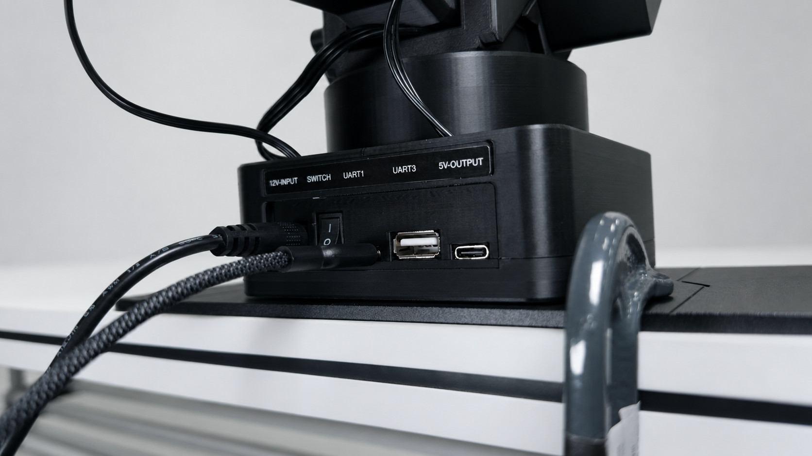
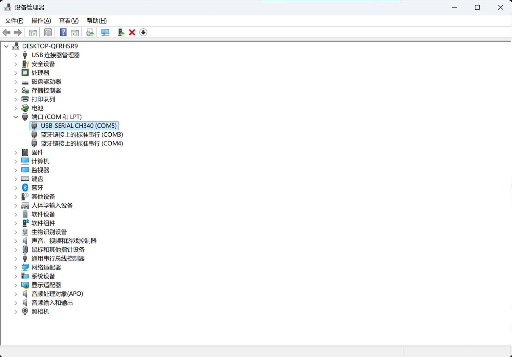
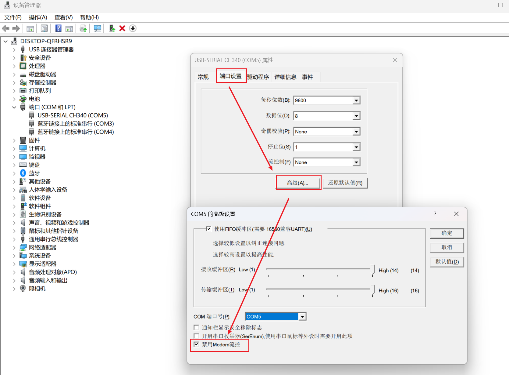
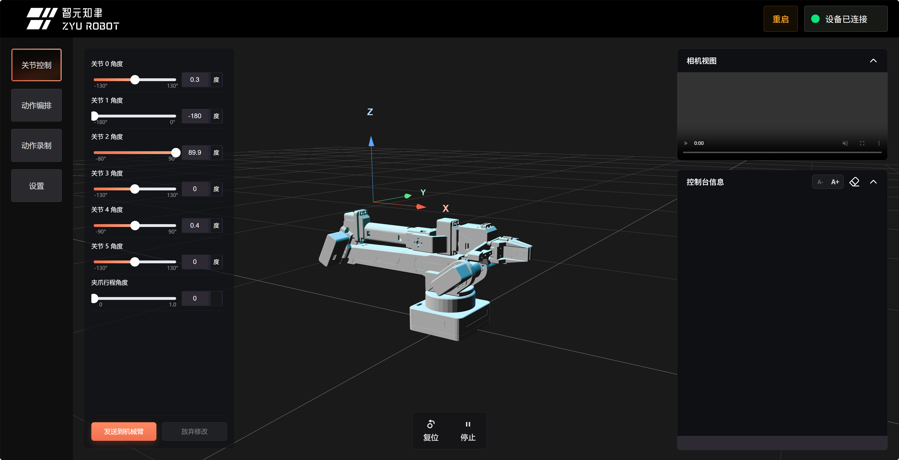
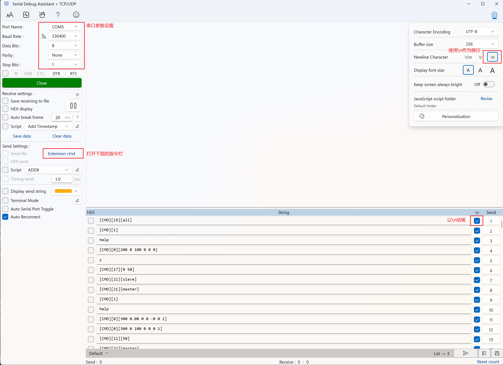
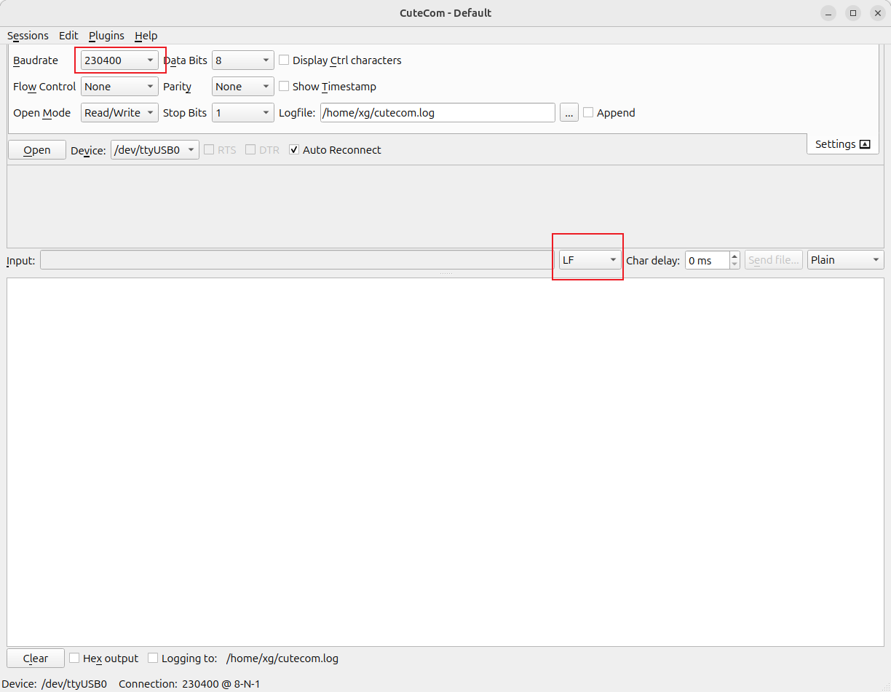
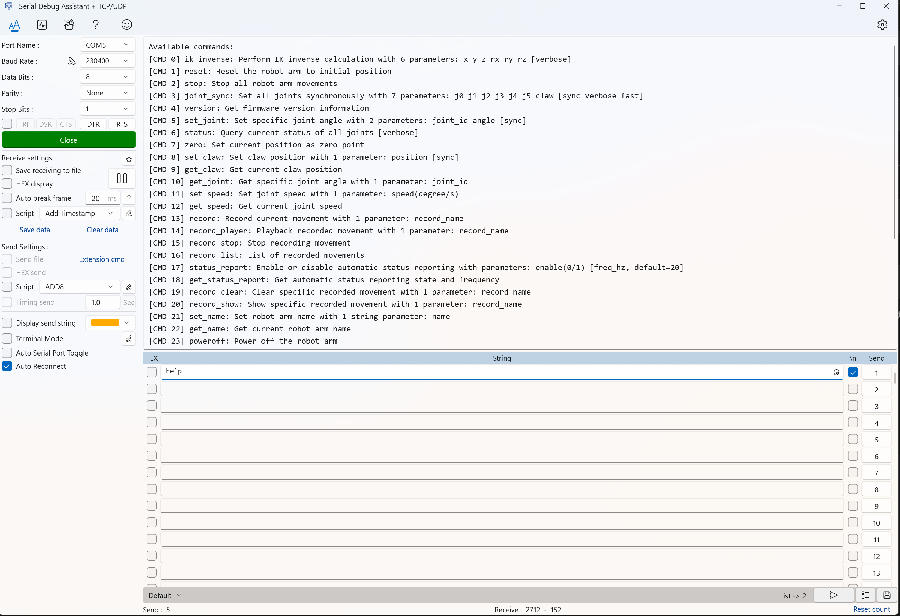

# 连接电脑并找到串口

这一页同时服务两条路线：

- 推荐路线：在官方 Web 控制台里用 Web Serial 选择机械臂串口。
- 备用路线：在串口工具里手动打开同一个机械臂串口。

两条路线使用的是同一个本地串口。区别只是“谁来打开串口”：官方 Web 由浏览器打开，串口工具由调试软件打开。同一时刻只能有一个程序占用这个端口。

## 推荐连接与上电顺序

1. 确认机械臂底座稳定，周围没有障碍物。
2. 确认机械臂电源开关处于关闭状态。
3. 连接机械臂配套电源。
4. 用 USB 数据线连接控制板和电脑。
5. 打开机械臂电源开关。
6. 关闭串口助手、Keil 或其他可能占用串口的软件。
7. 使用 Chrome / Edge 打开官方 Web 控制台：

```text
https://arm.zyairobot.com/#/zy
```

上电后先观察状态指示灯：机械臂状态正确时，指示灯为绿色；如果状态异常，指示灯为红色。看到红色指示灯时，不要继续发送动作命令，请先关闭电源并检查供电、线材、姿态和周围环境。



上图标出了快速上手时需要关注的主要连接：电源输入、控制板开关和串口通信线。不要把线接到不确定用途的接口上。

如果你的设备外壳标注了 `UART1` 和 `UART3`，快速上手默认使用 `UART1`。`UART1` 是机械臂控制板与电脑通信的串口；`UART3` 是机械臂控制板预留的对外串口，当前固件未使用，快速上手不要连接到 `UART3`。

## 安装驱动

控制板使用 CH340 USB 转串口芯片。Ubuntu 通常已经包含对应驱动；Windows 如果无法识别串口，或设备管理器中没有出现 `USB-SERIAL CH340`，请先安装 CH340 驱动。

CH340 的作用是把电脑的 USB 转换成控制板可以使用的串口通信。驱动安装成功后，Windows 才会给机械臂分配类似 `COM5` 的端口号，浏览器 Web Serial 弹窗也才有机会看到这个设备。

驱动下载地址：[WCH CH341SER 驱动](https://www.wch.cn/downloads/CH341SER_EXE.html)。

## Windows 找到 COM 端口

在设备管理器中查看“端口 (COM 和 LPT)”。常见结果类似：



其中 `COM5` 就是机械臂串口号。你的电脑上可能是 `COM2`、`COM3` 或其他编号。

`COMx` 只是 Windows 给串口设备分配的名字，不是固定值。换 USB 口、换电脑或重新安装驱动后，编号都可能变化。

如果不确定哪个端口是机械臂，可以先拔掉 USB，再插上，对比端口列表变化。新增的 `COMx` 一般就是机械臂串口。

如果没有看到“端口 (COM 和 LPT)”，可以尝试：

- 换一根支持数据传输的 USB 线。
- 换一个 USB 口。
- 检查控制板是否已经上电。
- 安装对应 USB 串口芯片驱动。

## Windows 串口高级设置

Windows 下 CH340 驱动可能会改变 DTR、RTS 引脚电平，导致控制器进入非预期状态。建议对当前机械臂对应的 `COMx` 做一次高级设置。

每个 `COMx` 端口都需要单独设置。机械臂换到新的 COM 端口后，请重新检查这一项。

1. 打开端口属性。
2. 选择“端口设置”。
3. 点击“高级”。
4. 勾选“禁用 Modem 流控”。



上图用于确认当前 `COMx` 已经关闭 Modem 流控。换 USB 口或更换电脑后，需要重新检查对应端口。

## Ubuntu 找到串口设备

连接 USB 后，常见设备名是：

- `/dev/ttyUSB0`
- `/dev/ttyACM0`

`/dev/ttyUSBx` 和 `/dev/ttyACMx` 是 Linux 下的设备文件名，作用类似 Windows 的 `COMx`。其中的数字也不是固定值，重插 USB 后可能变化。

可以执行：

```bash
ls /dev/ttyUSB* /dev/ttyACM* 2>/dev/null
```

如果不确定哪个设备是机械臂，可以先拔掉 USB，记录设备列表，再插上 USB，对比新增设备。新增的 `/dev/ttyUSBx` 或 `/dev/ttyACMx` 一般就是机械臂串口。

如果串口没有权限，可以临时使用 `sudo` 验证，或将当前用户加入 `dialout` 组后重新登录。

## 在官方 Web 中选择串口

1. 使用 Chrome / Edge 打开 `https://arm.zyairobot.com/#/zy`。
2. 确认页面通过 HTTPS 打开。
3. 点击页面右上角“请选择设备”。
4. 在浏览器弹出的串口选择窗口中，选择刚刚确认的机械臂串口。
5. 授权后等待页面连接。
6. 右上角显示“设备已连接”后，再继续下一页读取状态。



上图用于确认官方 Web 已经连接到本地机械臂串口。看到设备已连接后，可以继续下一步；如果页面提示状态异常，不要急着发送动作，先检查电源、USB、驱动和串口占用。

如果点击“请选择设备”后没有弹窗或看不到端口，按顺序检查：

- 是否使用 Chrome 或 Edge。
- 是否打开的是 `https://arm.zyairobot.com/#/zy`，而不是普通 HTTP 页面。
- 机械臂是否已经上电。
- USB 线是否支持数据传输。
- Windows 是否已经安装 CH340 驱动。
- 串口助手、Keil、Python 脚本或其他 Web 页面是否正在占用同一个串口。
- 浏览器是否被系统权限或企业策略禁止使用 Web Serial。

## 串口工具备用参数

当官方 Web 不可访问、浏览器不支持 Web Serial、串口无法在浏览器中选择，或你需要查看底层 ACK 时，可以改用串口工具。

快速上手备用路线使用下面参数：

| 参数 | 值 |
| --- | --- |
| Baud rate | `230400` |
| Data bits | `8` |
| Parity | `None` |
| Stop bits | `1` |
| Flow control | `None` |

也就是常说的 `230400, 8N1, no flow control`。三个参数必须和固件一致，否则可能打开了串口但收不到正确返回。

### Windows 串口调试助手设置

在 Serial Debug Assistant 中，端口选择实际的 `COMx`，波特率选择 `230400`，数据位 `8`，校验位 `None`，停止位 `1`，换行符选择 `\n`。



上图用于核对 Windows 串口调试助手的关键参数：串口号、`230400` 波特率、`8N1` 和换行发送。

### Ubuntu CuteCom 设置

在 CuteCom 中选择实际串口，例如 `/dev/ttyUSB0`，波特率设置为 `230400`，数据位 `8`，校验位 `None`，停止位 `1`，流控选择 `None`。发送命令时使用文本模式，并确保每条命令以 `LF` 换行结束。



图中 `/dev/ttyUSB0` 只是示例，请替换成你电脑上实际出现的设备名。红框标出了最容易漏掉的两项：波特率必须是 `230400`，输入框右侧的换行方式选择 `LF`。右侧发送模式保持 `Plain`，不要勾选底部的 `Hex output`。

## 串口工具发送规则

- 使用文本发送模式，不要使用十六进制发送模式。
- 每条命令发送后按回车，让串口工具发送 `LF`，也就是 `\n`。
- 如果串口工具有“发送新行”“追加换行”选项，请打开。
- 一条动作命令还没有完成时，不要连续发送多条动作命令。

固件命令格式类似：

```text
[CMD][命令编号][参数]
```

例如查询状态：

```text
[CMD][6]
```

`[CMD][6]` 里的 `6` 是固件定义的命令编号，表示查询状态。方括号是命令格式的一部分，需要一起发送。

## 成功标志

推荐路线中，成功标志是官方 Web 右上角显示“设备已连接”，并且后续状态同步没有持续异常。

备用路线中，成功标志是串口工具可以打开端口，并且发送 `help` 后看到当前固件支持的指令列表。



看到 `Available commands` 和一组 `[CMD x]` 指令列表，就说明串口发送和接收都已经正常。下一步开始读取机械臂状态。
