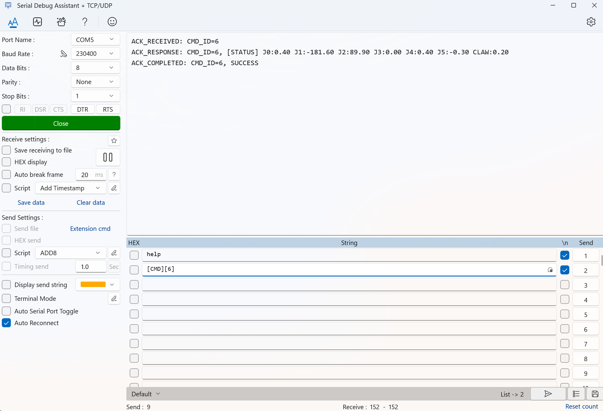

# 读取机械臂状态

读取状态是第一次控制前最重要的验证步骤。只有能读到状态，才说明电脑、串口、固件和机械臂之间的链路基本通了。

## 发送命令

当前固件支持 `status` 命令：

```text
[CMD][6]
```

`status` 是“查询状态”的意思。它不会让机械臂运动，只是让固件把当前 6 个关节和夹爪状态返回给串口软件。

命令定义位置：

- [firmware/Core/Src/arm_shell_cmd.c](../../firmware/Core/Src/arm_shell_cmd.c)

在串口软件里输入这条命令并按回车。正常情况下，机械臂会返回类似：

```text
ACK_RECEIVED: CMD_ID=6
[STATUS] J0:... J1:... J2:... J3:... J4:... J5:... CLAW:...
ACK_COMPLETED: CMD_ID=6, SUCCESS
```



上图用于对照 `CMD6` 的正常返回形式。实际关节角度和夹爪数值会随当前姿态变化，不需要和截图完全一致。

## 怎么判断成功

看到 `[STATUS]` 就说明状态读取成功。这里的 `J0` 到 `J5` 是固件返回的六个关节角度，`CLAW` 是夹爪状态。不同机械臂、不同姿态下，具体数值会不同。

`ACK_RECEIVED` 表示固件收到了命令，`ACK_COMPLETED` 表示命令处理结束。第一次上手时重点看是否出现 `[STATUS]`，不需要逐项分析所有 ACK。

第一次读取状态时，只需要确认能看到返回内容，不需要记录数值。后续执行第一次动作后，会再次读取状态并记录。

## 如果没有返回

如果收不到有效响应，不建议继续发送动作命令。可以按顺序检查：

- 串口号是否选对。
- 波特率是否为 `230400`。
- 串口参数是否为 `8N1`、无流控。
- 命令是否以文本方式发送。
- 发送后是否按了回车，或串口软件是否追加了换行。
- 机械臂是否已经上电。

仍然失败时，进入 [校准维护与排障](../08_校准维护与排障/README.md)，不要继续发送动作命令。

## 下一步

确认能读到 `[STATUS]` 后，再进入 [发送第一次动作](05_发送第一次动作.md)。下一步会先发送 `CMD1` 复位到初始姿态，再发送 `CMD0` IK 小动作。
