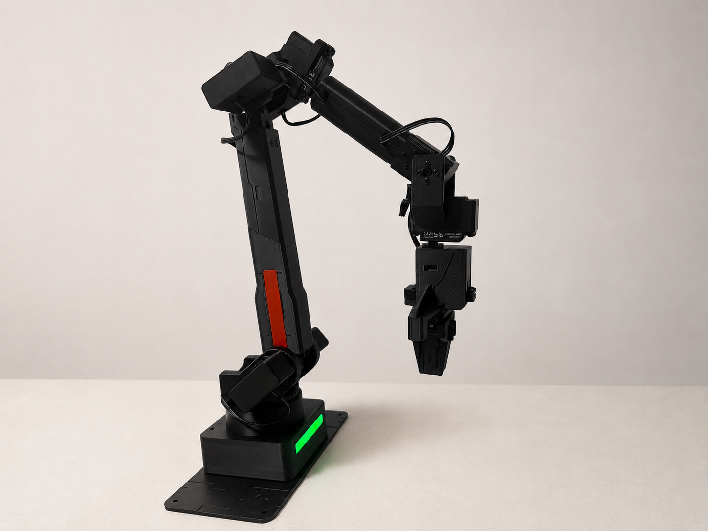

# 发送第一次动作

第一次动作只用于确认链路和执行能力，不追求复杂控制。推荐先在官方 Web 控制台里观察模型预览，再把一个低风险、小幅度动作发送到真实机械臂。

请始终区分两件事：

- 拖动滑块或填写草稿：只更新网页模型，不会驱动真机。
- 点击“发送到机械臂”、真实预览、运行全部、复位、停止：会通过串口向固件发送真实命令。

## 动作前检查

- 官方 Web 已经显示设备已连接。
- 页面状态没有持续异常。
- 机械臂周围留出空间。
- 你可以快速断电。
- 当前姿态适合执行复位动作和小幅动作。

## 先认识关节控制页


上图是关节控制页的总览。中间区域显示 3D 模型和关节控制面板，右侧显示控制台信息，顶部右侧显示设备连接状态。

第一次不要急着点击发送按钮。先观察模型、滑块和底部安全按钮的位置，确认自己知道“停止”和“复位”在哪里。

## 第一步：复位到安全起点

在页面底部点击“复位”，让机械臂回到初始姿态。复位会真实驱动机械臂，点击前再次确认周围没有障碍物。

如果复位过程中出现异常，优先点击“停止”；如果停止无效或来不及操作，直接切断机械臂电源。

## 第二步：填写一个很小的草稿

在关节控制页轻微调整一个关节滑块，建议只改一个关节，幅度尽量小。此时页面只是更新草稿和 3D 模型，不会立刻驱动真实机械臂。


上图用于确认你正在修改的是关节草稿。此时可以观察模型姿态是否合理；如果觉得不合适，点击“放弃修改”，让页面回到最近一次真实机械臂状态。

## 第三步：发送到真实机械臂

确认模型姿态安全后，再点击“发送到机械臂”。这一步会真实发送命令，机械臂会运动。

发送时观察三件事：

- 机械臂是否只做小幅动作。
- 右侧控制台是否显示成功或固件 ACK。
- 页面是否恢复到可继续操作状态。


上图用于确认关节控制命令已经成功发送并完成。实际关节数值不需要和截图完全一致，重点是动作幅度安全、页面没有报错。

## 第四步：练习停止和复位

完成第一次小幅动作后：

1. 点击“停止”，熟悉异常时的第一反应位置。
2. 点击“复位”，让机械臂回到初始姿态。
3. 如果页面或机械臂状态异常，先断电，再进入排障。

“停止”适合动作还在执行时中断；“复位”适合动作已经结束后回到安全起点。两者都是真机会执行的操作，不是模型预览。

## 串口备用：CMD1 和 CMD0

如果官方 Web 不可用，或你需要确认底层命令，可以关闭 Web 连接后用串口工具执行最小动作。

先复位：

```text
[CMD][1]
```

正常情况下，你会看到类似：

```text
ACK_RECEIVED: CMD_ID=1
ACK_COMPLETED: CMD_ID=1, SUCCESS
```

复位完成后，再发送项目方确认过的 IK 小动作：

```text
[CMD][0][200 0 0 0 0 0]
```

这条命令表示发送一个 IK 目标位姿：

```text
x=200, y=0, z=0, rx=0, ry=0, rz=0
```

固件会根据目标位姿计算关节角度，并控制机械臂运动。这里的 `200` 是目标位姿中的 X 方向位置，不是让当前姿态相对移动 200。



上图用于确认 IK 小动作已经发送并产生了可观察的位姿变化。若当前姿态或工作空间与示例不同，请先减小目标位移再测试。

## 成功标志

官方 Web 路线中，成功标志是：

- 你能先通过滑块观察模型变化。
- 点击“发送到机械臂”后，真实机械臂只完成一次小幅动作。
- 页面显示成功，没有持续异常。
- 点击“复位”后，机械臂能回到初始姿态。

串口备用路线中，成功标志是看到：

```text
ACK_RECEIVED: CMD_ID=0
ACK_COMPLETED: CMD_ID=0, SUCCESS
```

并观察到机械臂完成一次小动作。

如果返回 `ERROR`、没有返回或动作异常，请直接切断机械臂电源。确认原因前，不要继续发送动作命令。

## 下一步

动作完成后，进入 [记录状态并复现](06_记录状态并复现.md)。下一页会把第一次 Web 操作整理成一个可复盘的闭环，并保留 `CMD3` 作为底层状态复现练习。
