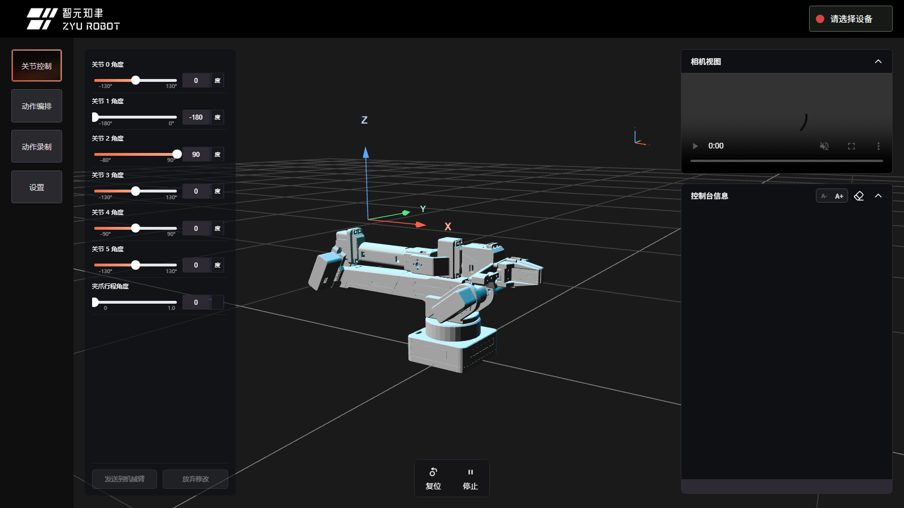
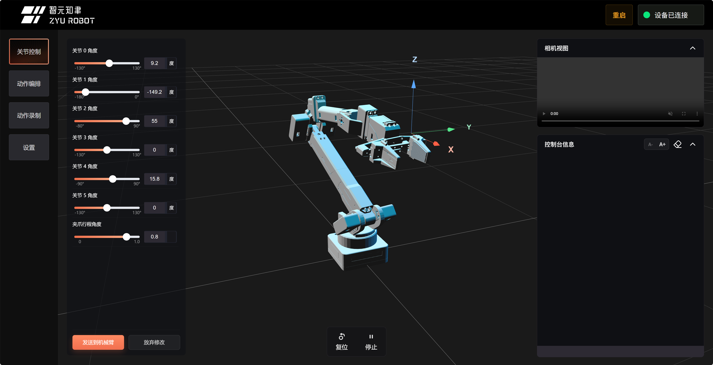
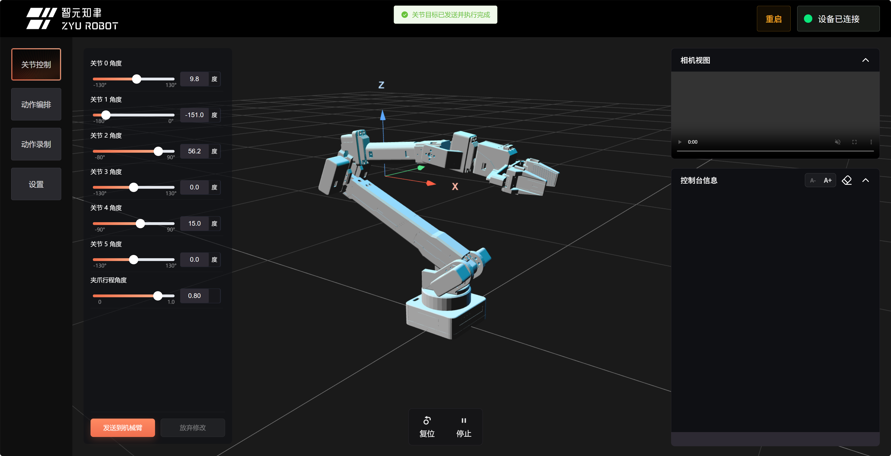
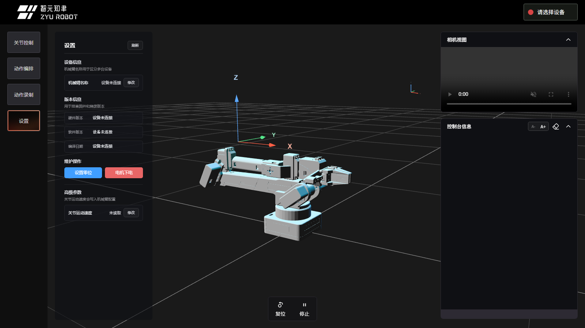
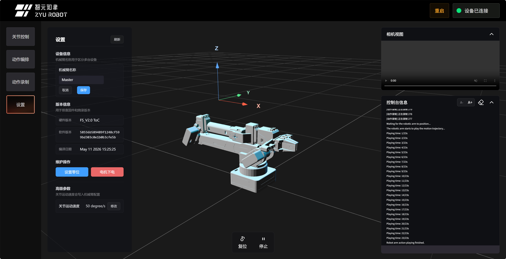
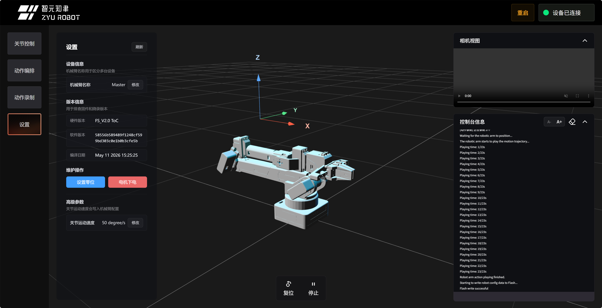

# Web 控制台入门

本页是完成 [快速上手](../02_快速上手/README.md) 后的 Web 控制台完整认识页。你已经会打开官方 Web、连接设备并发送一次小幅动作；这里会更系统地认识页面区域、设备状态、关节控制、控制台信息、设置页、停止、复位和硬件重启。

官方 Web 控制台地址：

```text
https://arm.zyairobot.com/#/zy
```

> 安全提醒：网页里的“模型预览”“填写草稿”“拖动滑块”不会驱动真机；“发送到机械臂”“真实预览”“运行全部”“复位”“停止”“硬件重启”等操作会真实发送指令。第一次操作时请空载、低速、保持手远离夹爪和连杆。



上图是 Web 控制台的主界面。左侧是功能选项卡，中间是 3D 模型和关节控制面板，右侧是相机视图和控制台信息，顶部右侧是设备连接状态和硬件重启入口。

## 你能用 Web 控制台做什么

| 功能 | 适合做什么 | 是否会驱动真机 |
| --- | --- | --- |
| 关节控制 | 调整 6 个关节和夹爪，先看模型姿态，再手动发送到机械臂 | 点击“发送到机械臂”后会 |
| 动作编排 | 把末端移动、关节同步、夹爪、等待、复位等步骤串成一个工作流 | 点击“真实预览”或“运行全部”后会 |
| 动作录制 | 从固件读取录制清单，创建、停止保存、删除录制动作 | 开始录制、停止保存、回放时会 |
| 设置 | 查看/修改机械臂名称、版本、速度，执行零位和下电操作 | 部分按钮会 |
| 控制台信息 | 查看用户主动命令的发送、ACK、错误和调试输出 | 手动输入命令后会 |
| 硬件重启 | 通过串口 DTR/RTS 触发硬件复位 | 会重启控制板 |

## 打开页面

优先使用官方在线地址：

```text
https://arm.zyairobot.com/#/zy
```

后续 Web 玩法都使用这个官网入口。官网暂时不可访问时，请按 [Web 控制台使用环境](../03_安装与准备/02_Web仿真环境.md) 中的备用路线切换到串口工具或 SDK。

## 连接机械臂

1. 给机械臂上电，并用 USB 数据线连接电脑。
2. 确认没有串口助手、Keil、Python 脚本或其他浏览器页面占用同一串口。
3. 打开官方 Web 页面，点击右上角“请选择设备”。
4. 在浏览器弹出的串口窗口中选择机械臂对应串口，例如 Windows `COM5`。
5. 连接成功后，右上角会显示“设备已连接”。


连接后，先确认右上角显示“设备已连接”。若页面提示异常，优先检查电源、USB 线、驱动和串口选择。

## 关节控制：先预览，再发送

关节控制页有 6 个关节滑块和 1 个夹爪滑块。拖动滑块时，只会更新网页模型，不会立刻驱动真实机械臂。

推荐新手按下面方式练习：

1. 轻微拖动一个关节滑块，观察 3D 模型变化。
2. 如果姿态不合适，点击“放弃修改”，模型会回到机械臂当前真实姿态。
3. 如果确认安全，点击“发送到机械臂”。
4. 等待页面提示成功，再继续下一次操作。



上图是“只影响模型”的阶段。你还可以反复调整、观察、放弃修改。



上图是“已经发送到机械臂”的阶段。真实动作完成后，再继续下一次调参。

这样设计是为了避免“滑块一松手机械臂就动”。真实机械臂只会在你明确点击发送按钮后执行。

## 复位、停止和硬件重启

页面底部中央有两个常用按钮：

- `复位`：让机械臂执行固件复位动作，适合回到安全起点。
- `停止`：用于中断当前动作。它优先级高，应该作为遇到异常动作时的第一反应。

顶部右侧的 `重启` 会通过串口 DTR/RTS 触发控制板硬件复位，并等待约 3 秒让固件重新启动。它适合固件状态异常、串口还能打开但指令无响应的场景。重启后通常需要等待页面恢复状态同步，必要时重新连接串口。

如果停止和重启都不能让状态恢复，或者机械臂动作已经不受控，直接切断机械臂电源。

## 右侧控制台怎么看

右侧“控制台信息”主要显示用户主动操作的反馈。例如你点击“发送到机械臂”、动作编排“真实预览”、手动输入串口命令时，这里会显示命令、ACK 和错误信息。

终端顶部有几个小按钮：

- `A-` / `A+`：缩小或放大终端字体，适合课堂投屏或小屏幕调试。
- 橡皮擦图标：清空终端显示。
- 折叠箭头：折叠终端面板。

如果页面提示失败或异常，先保留当前提示，再检查设备连接和参数。

## 设置页：看名称、版本和速度



设置页适合在开始多人课堂或多设备项目之前检查设备信息：

- 机械臂名称：用于区分多台设备。
- 版本信息：用于确认硬件版本、软件版本和编译日期。
- 维护操作：例如零位设置、电机下电。
- 高级参数：例如查看和修改关节运动速度。



如果现场有多台机械臂，建议给设备设置容易识别的名称，再在机身或线材上贴物理标签。



排障或反馈问题时，版本信息很有用。描述问题时可以一起记录硬件版本、软件版本和编译日期。

## 坐标系怎么理解

3D 模型附近有明显的 XYZ 坐标提示：

- 红色 `X`：X 方向。
- 绿色 `Y`：Y 方向。
- 蓝色 `Z`：向上方向。

做动作编排里的“末端移动”时，先看坐标系，再填写目标位置。新手建议先从小位移开始，例如只改变 X 或 Z，不要一次同时改变多个方向。

## 适合新手的练习顺序

```text
打开官方 Web
  -> 连接串口
  -> 观察关节控制页面
  -> 拖动滑块只看模型
  -> 放弃修改
  -> 小幅度发送到机械臂
  -> 点击停止验证急停入口
  -> 点击复位回到安全姿态
  -> 查看设置页名称和版本
  -> 再进入动作录制或动作编排
```

## 常见问题

| 现象 | 可能原因 | 处理方式 |
| --- | --- | --- |
| 右上角一直是“请选择设备” | 没有选择串口或浏览器不支持 Web Serial | 使用 Chrome/Edge，点击右上角选择设备 |
| 找不到 `COM5` | 线没接好、驱动异常、串口被其他软件占用 | 检查设备管理器，关闭串口助手或其他占用程序 |
| 点击发送后失败 | 机械臂未上电、固件返回错误或目标不可达 | 先看页面提示，再复位并小幅度测试 |
| 页面模型和真机不一致 | 你在网页做了草稿修改，尚未放弃或重新确认设备状态 | 点击“放弃修改”，必要时复位后再试 |
| 终端提示命令忙 | 当前有真实运动或终端命令尚未结束 | 等待完成，必要时点击“停止” |
| 动作异常 | 目标幅度过大、碰到限位或机械臂被阻挡 | 先点击“停止”，无效时直接断电 |

## 下一步

- 想录制一段真实动作：继续看 [动作录制与复现](02_动作录制与复现.md)。
- 想把多个动作串起来：继续看 [Web 动作编排工作流](07_Web动作编排工作流.md)。
- 想理解底层串口指令：阅读 [串口指令格式与回包](../04_基础操作/01_串口指令格式与回包.md)。
