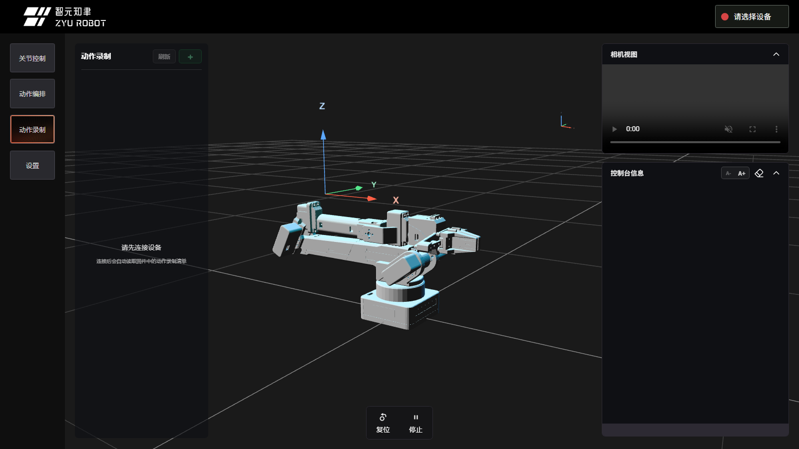
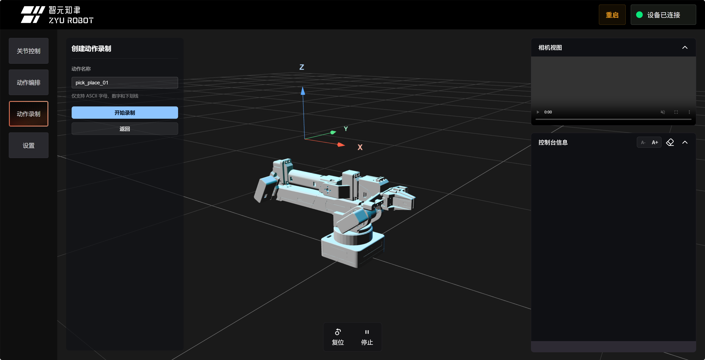
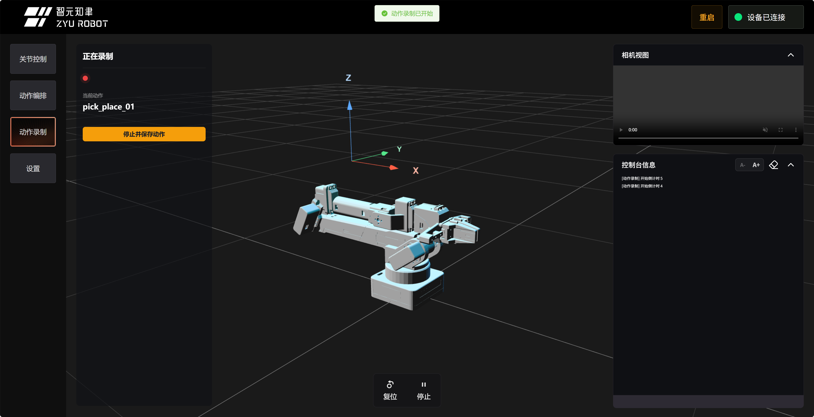
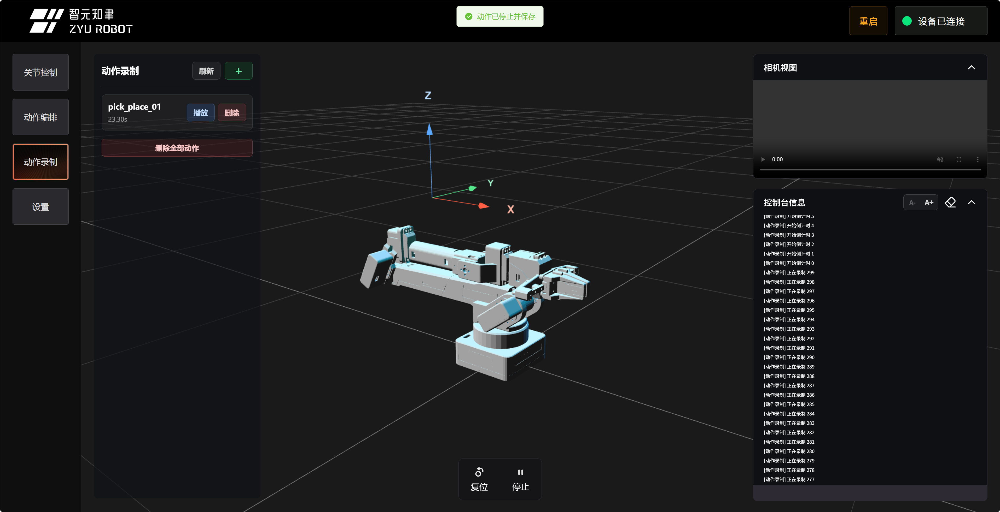

# 动作录制与复现

动作录制与复现适合做第一个真机演示项目：先把一段安全动作录下来，再让机械臂自动回放。这个玩法能直观看到“状态记录、动作存储、动作回放”的完整闭环。

这里的“录制”是记录机械臂各关节随时间变化的角度，不是录制视频。回放时固件会按记录的动作帧驱动机械臂运动。


上图用于展示动作录制与回放的整体效果：先手动摆出一段安全动作，再让机械臂按记录的动作帧自动复现。

## 推荐方式：官方 Web 控制台

完成快速上手后，推荐先用官方 Web 完成动作录制：

```text
https://arm.zyairobot.com/#/zy
```

Web 页面会自动读取固件里的录制清单，并提供创建、开始录制、停止保存、删除单个动作、删除全部动作等入口，比手动输入串口命令更适合第一次练习。



上图用于确认你已经进入“动作录制”页。连接设备后，页面会显示当前动作录制列表和创建入口。

## Web 录制前检查

- 机械臂已经通过 Web 显示“设备已连接”。
- 已经知道“停止”和直接断电的位置。
- 机械臂周围没有障碍物，线材不会被拖拽。
- 第一次录制只做空载、小幅、慢速动作。
- 不要在录制倒计时结束前强行掰动关节。

动作录制会让机械臂进入适合手动摆动的状态。录制中请轻柔移动，不要硬掰到关节极限。

## Web 录制流程

### 1. 创建动作名称

点击 `+` 或“创建第一个动作录制”，输入动作名称。建议使用 ASCII 字母、数字和下划线，例如：

```text
demo_01
```



动作名称建议短一点，并能看出用途。不要使用空格、中文或特殊符号，避免和固件存储、串口命令兼容性冲突。

### 2. 开始录制

确认名称后点击开始录制。固件会进入录制流程，通常会有倒计时或录制状态提示。

录制开始前不要急着移动机械臂。等待页面确认正在录制，或固件倒计时结束后，再轻柔拖动机械臂。



上图用于确认当前处于录制中状态。录制中不要切换到动作编排或发送其他真实动作命令。

### 3. 轻柔完成动作

第一次动作建议非常简单，例如：

```text
轻轻抬起末端
  -> 小幅向左或向右
  -> 停住 1 秒
  -> 回到接近原来的姿态
```

不要夹物体，不要靠近桌面边缘，不要让线材进入关节运动范围。

### 4. 停止并保存

动作完成后，点击“停止并保存动作”。保存过程中等待页面完成，不要断电、刷新页面或重复点击。

保存完成后，页面会刷新录制列表。

### 5. 列表确认



确认列表里能看到刚才的动作名称，例如 `demo_01`。如果没有出现，先点击刷新；仍然没有时，再切换到串口备用路线确认固件返回。

固件当前最多保存 3 个动作录制。录制数量达到上限时，页面会提示先删除动作再录制。删除全部动作前请确认课堂或比赛现场是否还需要旧动作。

## 如何回放录制动作

当前文档确认的 Web 动作录制页主要负责创建、录制、停止保存和列表管理。回放录制动作建议使用两种方式：

- 在 [Web 动作编排工作流](07_Web动作编排工作流.md) 中添加“播放录制”步骤，再真实预览或运行全部。
- 使用串口备用命令 `[CMD][14][动作名称]` 回放。

如果你使用的 Web 页面版本提供了直接回放按钮，以页面实际按钮为准；回放前仍然要确认周围空间和断电方式。

## 串口备用方式

下面的串口方式适合你想学习底层命令、排查固件返回，或不使用 Web 控制台时参考。

## 目标效果

完成本玩法后，你应该能：

- 用 Web 或串口指令开始录制动作。
- 在关节卸力后，轻柔地摆出一段动作。
- 停止录制并查看录制列表。
- 回放刚才录制的动作。

## 需要准备

- 一台已经完成 [快速上手](../02_快速上手/README.md) 的机械臂。
- 官方 Web 控制台，或串口软件。
- 足够的桌面空间。
- 可以快速切断机械臂电源的方式。

开始前建议先阅读 [动作录制与回放](../04_基础操作/06_动作录制与回放.md)，了解 `CMD13`、`CMD14`、`CMD15`、`CMD16`、`CMD19` 和 `CMD20`。

## 串口推荐流程

下面按流程放置串口软件截图。截图用于核对当前阶段和返回形式；动作名、关节角度、录制帧数等数值以实际设备为准。

### 1. 复位到初始姿态

先让机械臂回到一个可控的起点：

```text
[CMD][1]
```

复位完成后，确认机械臂周围没有障碍物，再继续录制。

### 2. 开始录制

发送录制命令，`demo_01` 是本次动作的名称：

```text
[CMD][13][demo_01]
```

固件会倒计时 5 秒，随后关节进入卸力状态，方便手动摆动机械臂。倒计时结束、确认已经卸力前，不要强行掰动关节。


看到倒计时提示后，等待倒计时结束；关节进入卸力状态后，再轻柔地移动机械臂。

### 3. 停止录制

完成一段低风险动作后，发送停止录制命令：

```text
[CMD][15]
```


如果串口返回停止录制相关提示，说明本次录制已经结束。此时不要急着回放，先确认动作是否已经保存。

### 4. 查看录制清单

列出当前已经保存的动作：

```text
[CMD][16]
```


确认列表中能看到 `demo_01`，再继续查看动作帧。

### 5. 查看动作帧信息

打印指定动作中记录下来的关节角度和夹爪数据：

```text
[CMD][20][demo_01]
```


`CMD20` 只会打印录制动作中每一帧的关节角度和夹爪值，不会驱动机械臂运动。

如果这里能看到连续的关节数据，说明动作已经被记录下来。回放前再次检查桌面空间、线材和夹爪附近是否安全。

### 6. 回放动作

确认周围安全后，回放刚才录制的动作：

```text
[CMD][14][demo_01]
```


固件会先让机械臂移动到录制动作的第一帧附近，再开始播放后续动作。回放过程中不要把手伸入夹爪或连杆运动范围。

### 7. 回到初始姿态

回放结束后，建议再次复位：

```text
[CMD][1]
```

## 成功现象

- Web 录制列表能看到刚录制的动作名称，或串口 `CMD16` 能看到名称。
- 串口 `CMD20` 能打印动作帧信息。
- 回放时机械臂先移动到录制动作的第一帧附近，再开始播放后续动作。
- 机械臂动作平稳，没有碰撞、拉线或卡住。

## 安全提醒

- 第一次录制建议只做小幅度、空载动作。
- 录制倒计时结束前不要强行掰动关节。
- 回放前移开桌面杂物，并保持手远离夹爪和连杆。
- 如果录制数量已满，需要先删除旧动作；`[CMD][19][all]` 会删除全部录制动作，课程或比赛现场要谨慎使用。
- 出现异常时优先点击 Web 的“停止”；无效或来不及时，直接切断机械臂电源。
