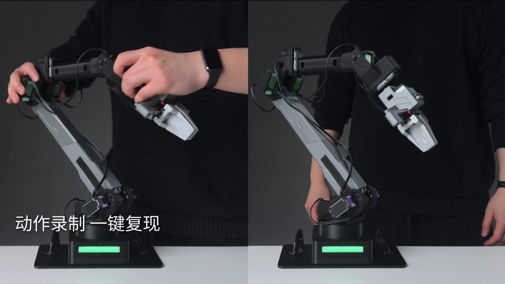
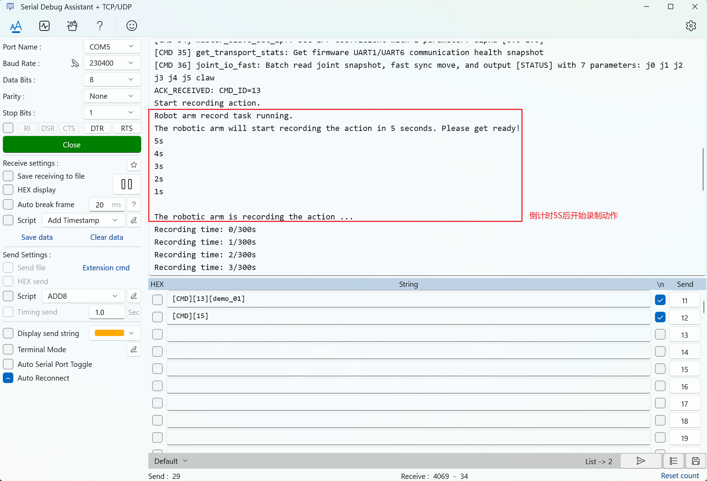
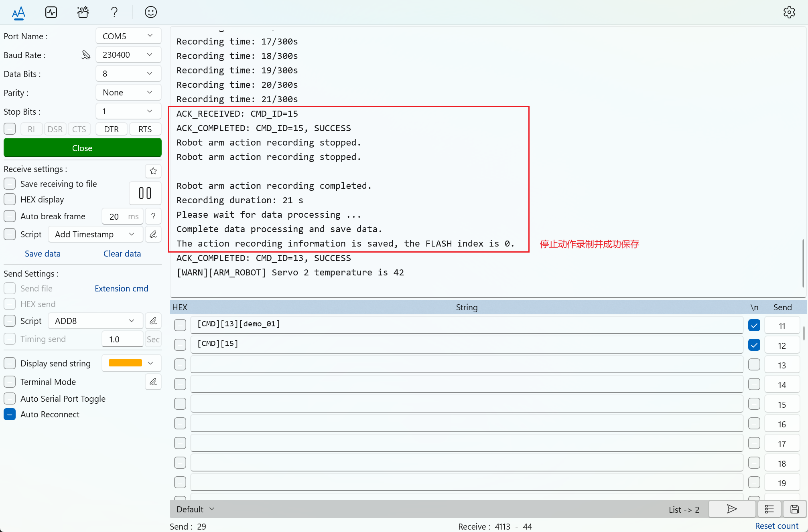
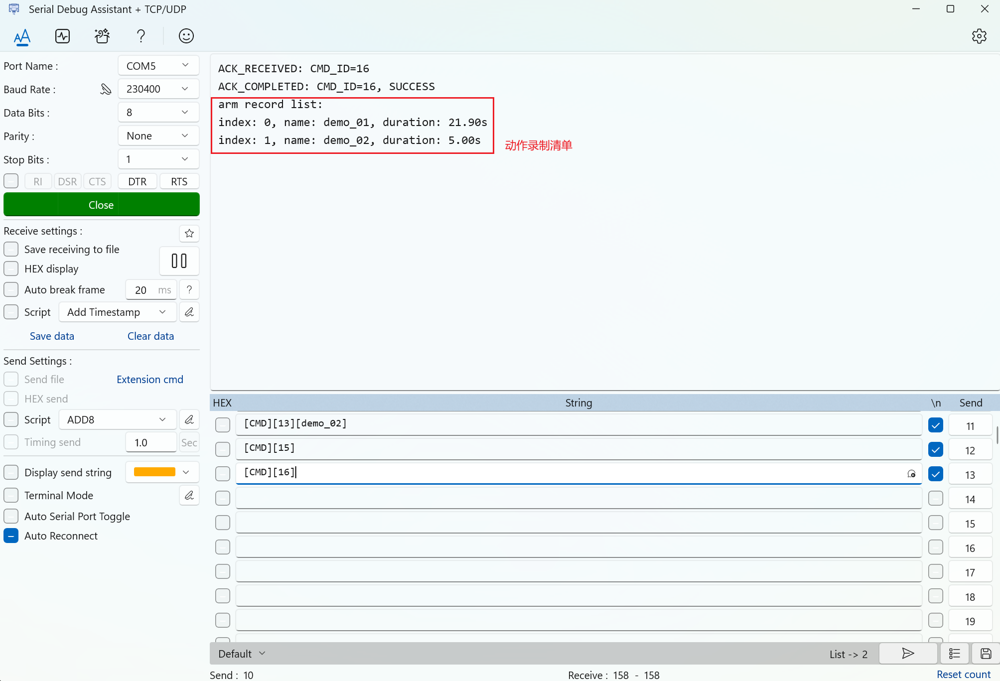
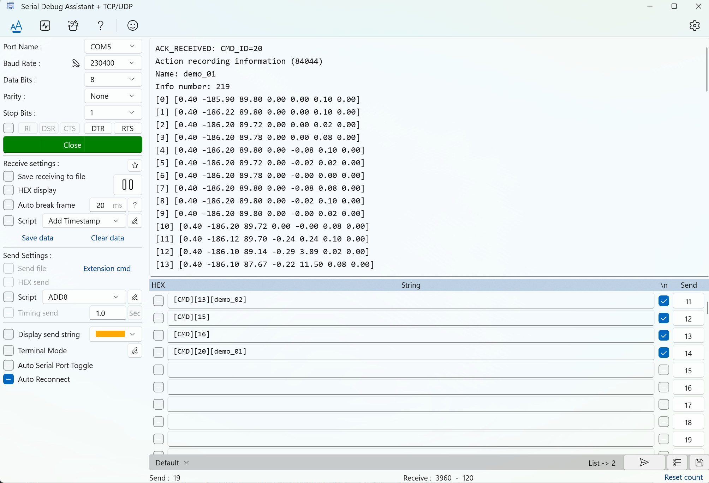
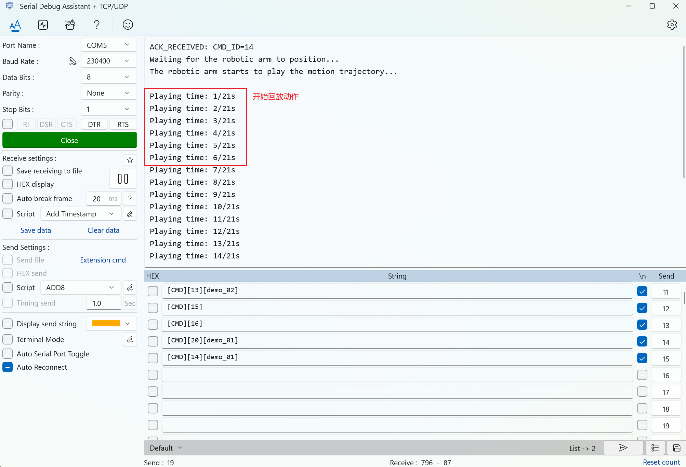

# 动作录制与复现

动作录制与复现适合做第一个真机演示项目：先把一段安全动作录下来，再让机械臂自动回放。这个玩法能直观看到“状态记录、动作存储、动作回放”的完整闭环。

这里的“录制”是记录机械臂各关节随时间变化的角度，不是录制视频。回放时固件会按记录的动作帧驱动机械臂运动。



上图用于展示动作录制与回放的整体效果：先手动摆出一段安全动作，再让机械臂按记录的动作帧自动复现。后续步骤会用串口截图核对每个阶段的返回结果。

## 目标效果

完成本玩法后，你应该能：

- 用串口指令开始录制动作。
- 在关节卸力后，轻柔地摆出一段动作。
- 停止录制并查看录制列表。
- 回放刚才录制的动作。

## 需要准备

- 一台已经完成 [快速上手](../02_快速上手/README.md) 的机械臂。
- 串口软件。
- 足够的桌面空间。
- 可以快速切断机械臂电源的方式。

开始前建议先阅读 [动作录制与回放](../04_基础操作/06_动作录制与回放.md)，了解 `CMD13`、`CMD14`、`CMD15`、`CMD16`、`CMD19` 和 `CMD20`。

## 推荐流程

下面按流程放置串口软件截图。截图用于核对当前阶段和返回形式；动作名、关节角度、录制帧数等数值以实际设备为准。

### 1. 复位到初始姿态

先让机械臂回到一个可控的起点：

```text
[CMD][1]
```

复位完成后，确认机械臂周围没有障碍物，再继续录制。

### 2. 开始录制

发送录制命令，`demo_01` 是本次动作的名称：

```text
[CMD][13][demo_01]
```

固件会倒计时 5 秒，随后关节进入卸力状态，方便手动摆动机械臂。倒计时结束、确认已经卸力前，不要强行掰动关节。



看到倒计时提示后，等待倒计时结束；关节进入卸力状态后，再轻柔地移动机械臂。

### 3. 停止录制

完成一段低风险动作后，发送停止录制命令：

```text
[CMD][15]
```



如果串口返回停止录制相关提示，说明本次录制已经结束。此时不要急着回放，先确认动作是否已经保存。

### 4. 查看录制清单

列出当前已经保存的动作：

```text
[CMD][16]
```



确认列表中能看到 `demo_01`，再继续查看动作帧。

### 5. 查看动作帧信息

打印指定动作中记录下来的关节角度和夹爪数据：

```text
[CMD][20][demo_01]
```



`CMD20` 只会打印录制动作中每一帧的关节角度和夹爪值，不会驱动机械臂运动。

如果这里能看到连续的关节数据，说明动作已经被记录下来。回放前再次检查桌面空间、线材和夹爪附近是否安全。

### 6. 回放动作

确认周围安全后，回放刚才录制的动作：

```text
[CMD][14][demo_01]
```



固件会先让机械臂移动到录制动作的第一帧附近，再开始播放后续动作。回放过程中不要把手伸入夹爪或连杆运动范围。

### 7. 回到初始姿态

回放结束后，建议再次复位：

```text
[CMD][1]
```

## 成功现象

- `CMD16` 能看到刚录制的动作名称。
- `CMD20` 能打印动作帧信息。
- `CMD14` 会先移动到录制动作的第一帧附近，再开始播放后续动作。
- 机械臂动作平稳，没有碰撞、拉线或卡住。

## 安全提醒

- 第一次录制建议只做小幅度、空载动作。
- 录制倒计时结束前不要强行掰动关节。
- 回放前移开桌面杂物，并保持手远离夹爪和连杆。
- 如果录制数量已满，需要先删除旧动作；`[CMD][19][all]` 会删除全部录制动作，课程或比赛现场要谨慎使用。
- 出现异常时优先直接切断机械臂电源。
