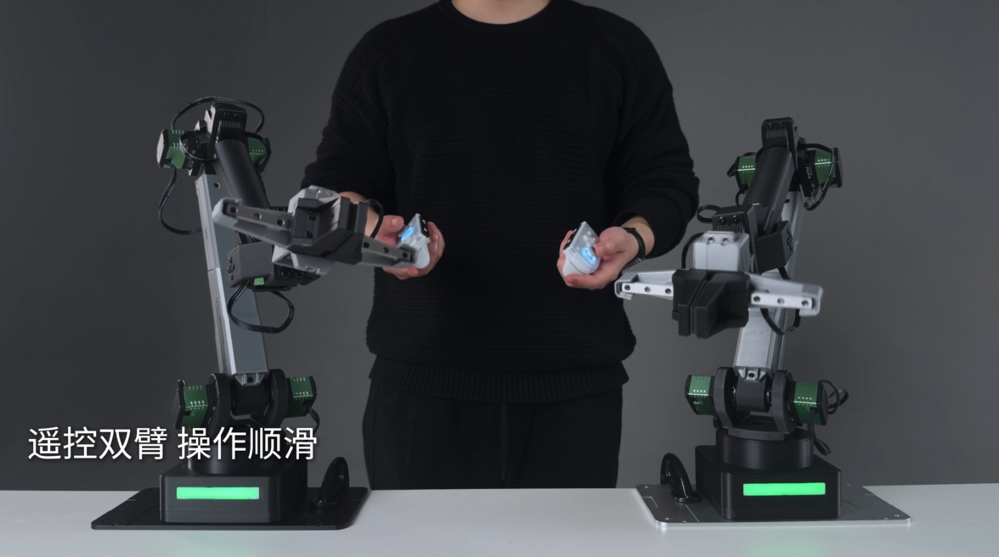
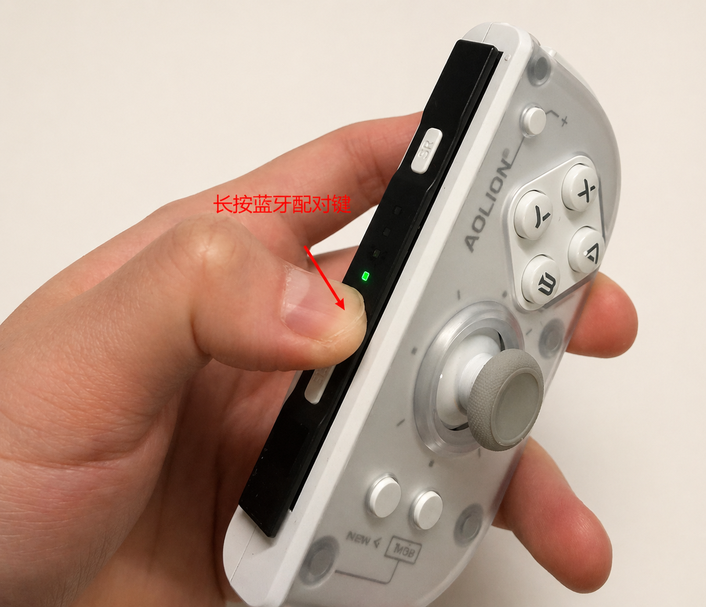
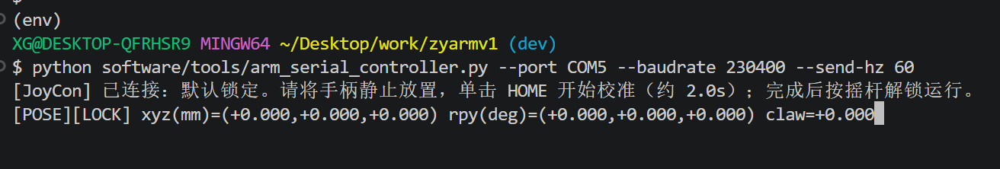
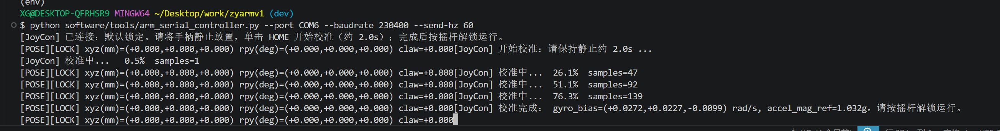
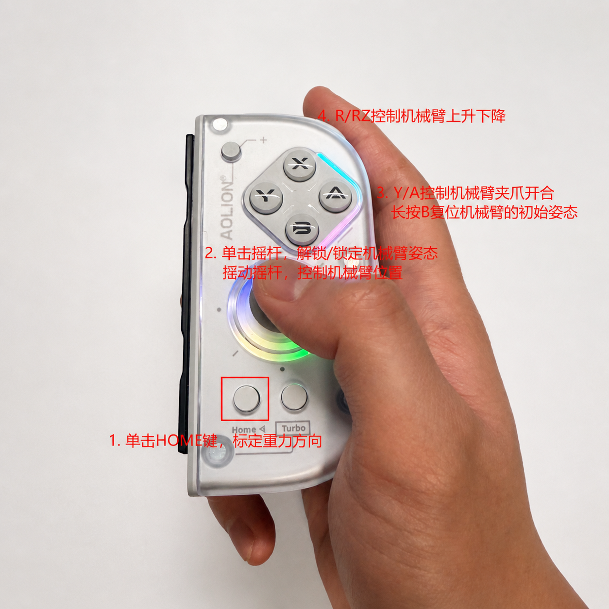

# 手柄遥操

手柄遥操适合体验“外部手持输入设备实时控制机械臂”。这类玩法会连续发送控制数据，不建议手工在串口软件里高频输入固件指令，应优先使用仓库提供的工具脚本。

本页只讲单台机械臂配合手柄或 Joy-Con 的遥控体验。如果你想用一台机械臂控制另一台机械臂，请阅读 [主从臂遥操](04_主从臂遥操.md)。



上图用于展示单臂手柄遥操的整体效果：手柄作为输入端，工具脚本把摇杆、按键和姿态输入转换为机械臂的小幅连续动作。

## 目标效果

完成本玩法后，你应该能：

- 用手柄或 Joy-Con 控制机械臂末端小幅移动。
- 观察手柄输入和机械臂运动之间的对应关系。
- 理解遥控模式、遥控复位、解锁和退出之间的关系。

## 需要准备

- 一台已经完成 [快速上手](../02_快速上手/README.md) 的机械臂。
- 已确认的机械臂串口号，例如 Windows `COM3` 或 Ubuntu `/dev/ttyUSB0`。
- 手柄或 Joy-Con。
- Python 环境和工具依赖。
- 可以快速切断机械臂电源的方式。

工具入口见 [software/tools/README.md](../../software/tools/README.md)。

## 推荐入口

仓库中已有的手柄遥操相关工具包括：

| 工具 | 用途 |
| --- | --- |
| [arm_serial_controller.py](../../software/tools/arm_serial_controller.py) | Joy-Con 到机械臂串口遥控，会自动进入遥控模式并发送遥控指令 |
| [joycon_sixdof_controller.py](../../software/tools/joycon_sixdof_controller.py) | Joy-Con 六自由度输入解析，负责把姿态、摇杆和按键转换成虚拟位姿 |
| [JOYCON_SIXDOF_TUNING_GUIDE.md](../../software/tools/JOYCON_SIXDOF_TUNING_GUIDE.md) | Joy-Con 手感、死区和灵敏度调参参考 |

其中 `arm_serial_controller.py` 是面向真实机械臂的主要入口。`joycon_sixdof_controller.py` 更像底层输入模块，通常不需要学习者直接修改。

## 推荐流程

当前已验证 [AOLION 澳加狮 J20 骑士手柄](https://detail.tmall.com/item.htm?ali_refid=a3_420434_1006%3A1264470076%3AH%3Ac3N33yiquUVS%2BdiwWFUaZw%3D%3D%3A736d51286aab7e56c1b136b6641bffdf&ali_trackid=318_736d51286aab7e56c1b136b6641bffdf&id=842813078082&mi_id=0000MJgm7vOlN08hBwLLNlvjBPVPxdo-PB74fUPE4kv9Jqw&mm_sceneid=0_0_750310007_0&priceTId=2147803317779685579768191e1235&skuId=5970764212380&spm=a21n57.1.hoverItem.10&utparam=%7B%22aplus_abtest%22%3A%22b736196f533912ace1ed2c52a72c73f4%22%7D&xxc=ad_ztc)，可以作为参考型号。其他手柄需要先确认是否能被系统识别，以及按键映射是否与本文一致。

1. 先用 `[CMD][6]` 确认机械臂状态可读。
2. 用 `[CMD][1]` 让机械臂复位。
3. 确认桌面空间、线材和断电方式。
4. 长按手柄配对键，直到指示灯快速闪烁，进入蓝牙配对状态。



上图用于确认手柄已经进入可配对状态。不同手柄的按键位置和指示灯样式可能不同，以实际设备为准。

5. 在系统蓝牙设置中完成配对，并确认系统能读取手柄输入。
6. 安装工具依赖，参考 [software/tools/README.md](../../software/tools/README.md)。
7. 运行串口遥控脚本，低速、小幅度试运行。
8. 退出工具后，再次复位并检查机械臂状态。

Joy-Con 串口遥控示例：

```bash
python software/tools/arm_serial_controller.py --port COM3 --baudrate 230400 --send-hz 60
```

Ubuntu 示例：

```bash
python3 software/tools/arm_serial_controller.py --port /dev/ttyUSB0 --baudrate 230400 --send-hz 60
```

脚本正常启动后，终端会显示手柄连接状态、锁定状态和当前遥控位姿。看到 `[POSE][LOCK]` 说明脚本已经进入遥控界面，但还没有解锁发送运动控制。



上图用于确认遥操脚本已经启动，并能持续输出设备状态和输入状态。解锁前不要发送大幅动作。

参数含义：

| 参数 | 含义 |
| --- | --- |
| `--port` | 机械臂串口号，例如 `COM3` 或 `/dev/ttyUSB0` |
| `--baudrate` | 串口波特率，快速上手流程默认使用 `230400` |
| `--send-hz` | 脚本每秒发送控制数据的次数 |
| `--device {right,left}` | 当前使用左或右手手柄，默认为右手手柄 |

第一次运行建议使用文档推荐值，不要先提高频率或动作幅度。

## 操作指南

1. 正确连接手柄后，运行 `arm_serial_controller.py`。看到如下界面后，将手柄水平拿起，单击 `HOME` 键进行重力标定。



上图用于确认脚本正在等待水平姿态基准。标定时保持手柄静止，避免把倾斜姿态记录为零点。

2. 标定完成后，按下摇杆解锁遥控输入。解锁后，脚本才会根据手柄输入发送控制数据。
3. 轻推摇杆，控制机械臂末端在水平面内移动。
4. 按住 `Y` / `A` 调整夹爪开合。
5. 默认使用右手手柄时，按住 `R` 控制末端上升，按住 `ZR` 控制末端下降；如果使用左手手柄，对应为 `L` / `ZL`。
6. 长按 `B` 触发遥控复位，让机械臂回到遥控初始位置/姿态。



上图只作为按键关系参考。正式控制前，仍以脚本输出和机械臂实际运动方向为准。

## 使用边界

- 不建议手工发送 `CMD24`、`CMD25`、`CMD26` 来做连续遥控。
- 不建议一开始就提高发送频率或动作幅度。
- 如果输入方向和机械臂运动方向不一致，先停止工具并检查配置，不要边运动边临时调整。
- 手柄或 Joy-Con 的连接、配对和标定方式需要按具体设备确认。
- 如果要使用一台机械臂作为输入设备，请切换到 [主从臂遥操](04_主从臂遥操.md)。
