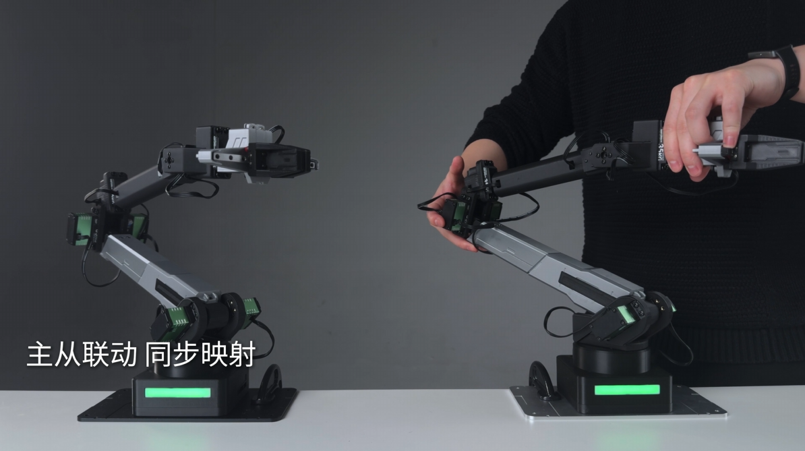
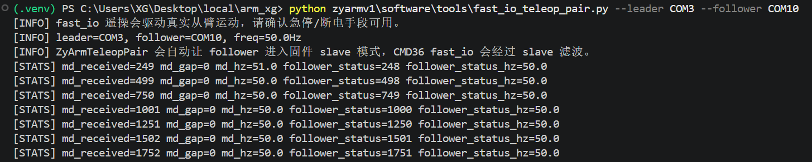

# 主从臂遥操

主从臂遥操用于让一台机械臂作为 master，另一台机械臂作为 slave 跟随运动。这个玩法展示效果强，也适合作为 LeRobot 数据采集和模仿学习前的设备验证。正式进入 LeRobot 采集前，请继续阅读 [科研与数据采集](../07_科研与数据采集/README.md)。

以机械臂作为输入端的遥操属于主从臂遥操的一种形式：输入来源不是手柄，而是另一台被人移动的机械臂。如果你只想用手柄或 Joy-Con 控制单台机械臂，请阅读 [手柄遥操](03_手柄遥操.md)。

master 是被人操作或作为输入来源的主臂，slave 是跟随 master 运动的从臂。文档里的 leader/follower 和 master/slave 表达都用于区分“输入端”和“跟随端”。



上图用于建立主从遥操的设备关系：master / leader 作为输入端，slave / follower 作为跟随端。运行脚本前，先按这个关系确认摆放方向、线材余量和设备标签。

## 目标效果

完成本玩法后，你应该能：

- 区分两台机械臂的串口、物理标签和固件名称。
- 启动主从遥操工具。
- 让 slave 跟随 master 的动作。
- 观察延迟、抖动、丢帧或线材干扰问题。

## 需要准备

- 两台机械臂。
- 两个独立串口。
- 稳定供电和足够桌面空间。
- 可以快速切断两台机械臂电源的方式。

开始前请先逐台确认机械臂都能单独 `[CMD][6]` 读取状态、`[CMD][1]` 复位，并给两台设备贴上物理标签。物理标签是贴在设备或线材上的人工标记，固件名称是写入控制板的名称。两者配合使用，可以减少多台设备接反的概率。

## 设备记录

建议先记录：

| 角色 | 串口 | 固件名称 | 物理标签 | 备注 |
| --- | --- | --- | --- | --- |
| master | `COM3` 或 `/dev/ttyUSB0` | `master` |  |  |
| slave | `COM4` 或 `/dev/ttyUSB1` | `slave` |  |  |

可以使用 `CMD21`/`CMD22` 设置和读取名称，也可以使用工具脚本确认名称和版本：

```text
[CMD][21][master]
[CMD][22]
```

另一台机械臂设置为：

```text
[CMD][21][slave]
[CMD][22]
```

`CMD22` 正常会返回类似：

```text
ACK_RESPONSE: CMD_ID=22, NAME:master
```

```bash
python software/tools/get_arm_info.py COM3 -b 230400
python software/tools/get_arm_info.py COM4 -b 230400
```

Ubuntu 示例：

```bash
python3 software/tools/get_arm_info.py /dev/ttyUSB0 -b 230400
python3 software/tools/get_arm_info.py /dev/ttyUSB1 -b 230400
```

连接前请确认：

- master 和 slave 没有接反。
- 两台机械臂都能单独通过 `[CMD][6]` 读取状态。
- 两台机械臂都能通过 `[CMD][22]` 读到预期名称。
- 两台机械臂都能通过 `[CMD][1]` 复位。
- 两根 USB 串口线和电源线不会互相拉扯，也不会进入运动范围。

## 推荐入口

主从遥操建议通过脚本运行，不建议手工连续发送固件指令。

| 工具 | 推荐场景 |
| --- | --- |
| [filtered_master_slave_teleop.py](../../software/tools/filtered_master_slave_teleop.py) | 滤波手感优先的主从遥控 |
| [fast_io_teleop_pair.py](../../software/tools/fast_io_teleop_pair.py) | 基于 SDK fast_io 的主从遥控和采集链路验证 |
| [master_slave_remote.py](../../software/tools/master_slave_remote.py) | 旧入口兼容 wrapper，后续优先使用 `filtered_master_slave_teleop.py` |

建议优先比较前两个入口：`filtered_master_slave_teleop.py` 负责常规滤波主从控制，适合先验证角色、方向和跟随频率；`fast_io_teleop_pair.py` 基于 SDK `fast_io` 进行主从控制，并持续返回从臂状态，适合观察状态回传和链路稳定性。

滤波主从遥操示例：

```bash
python software/tools/filtered_master_slave_teleop.py --mode 1 --master COM3 --slave COM4 --freq 50
```

Ubuntu 示例：

```bash
python3 software/tools/filtered_master_slave_teleop.py --mode 1 --master /dev/ttyUSB0 --slave /dev/ttyUSB1 --freq 50
```

fast_io 主从遥操示例：

```bash
python software/tools/fast_io_teleop_pair.py --leader COM3 --follower COM4 --baudrate 230400 --freq 50
```

参数含义：`--master` / `--leader` 是主臂端口，`--slave` / `--follower` 是从臂端口，`--freq` 是跟随频率。端口接反会导致动作方向和角色错乱，运行前一定要核对标签。



上图以 `fast_io_teleop_pair.py` 为例，用于确认主从臂已经正常同步，并且从臂能够按 `50 Hz` 频率持续返回状态。

## 成功现象

- 两台机械臂的端口和角色没有接反。
- 工具能正常打开两个串口。
- master 产生动作时，slave 能跟随运动。
- 运动过程中线材不会拉扯、缠绕或进入运动范围。

## 安全提醒

- 第一次运行时不要抓取物体。
- master 和 slave 周围都要留出安全空间。
- 不要把两台机械臂摆得过近，避免跟随时互相碰撞。
- 电源适配器放在稳定位置，不悬空拉扯。
- USB 串口线和供电线分开走线，线材预留余量，但不要形成会被关节扫到的线圈。
- 保留可以快速断电的空间，不要把电源开关压在设备下面。
- 运动异常、端口接反或线材拉扯时，优先直接断电。
