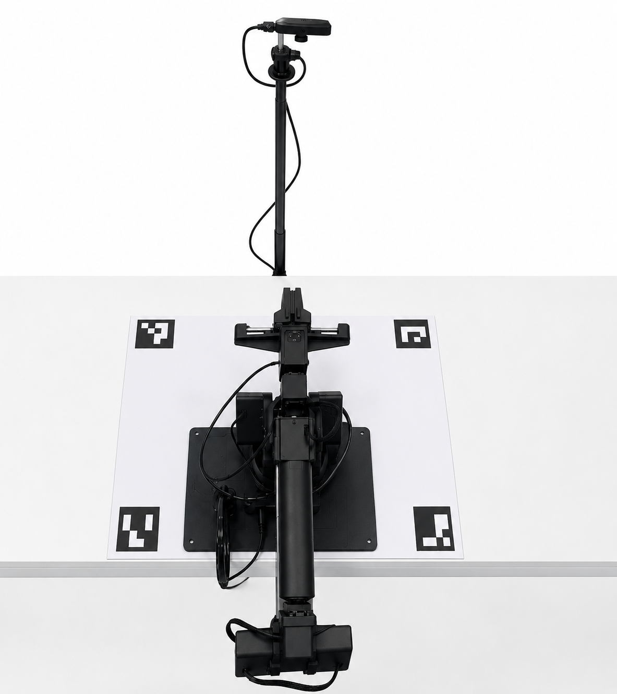
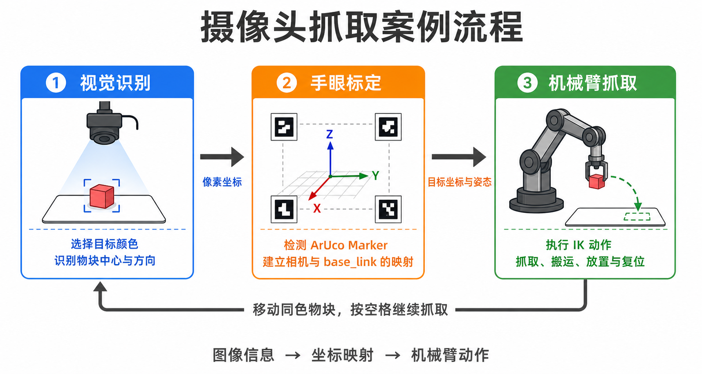
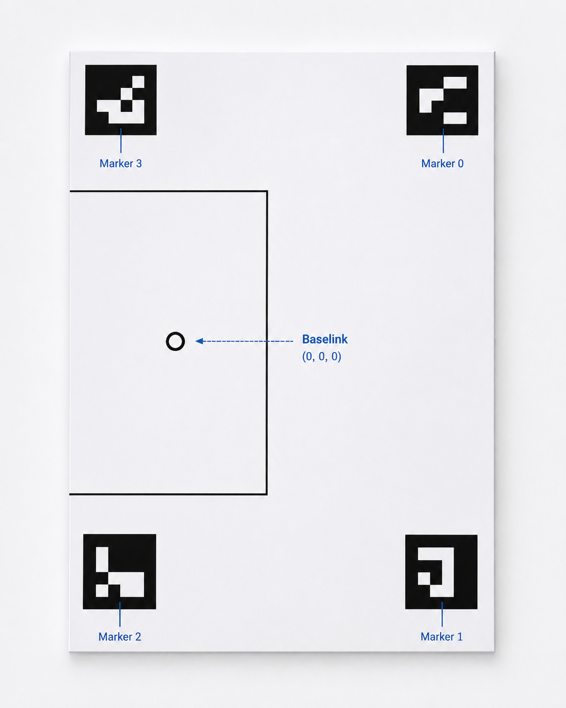
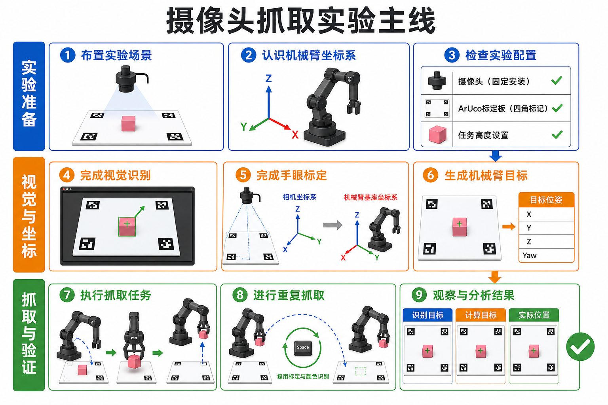
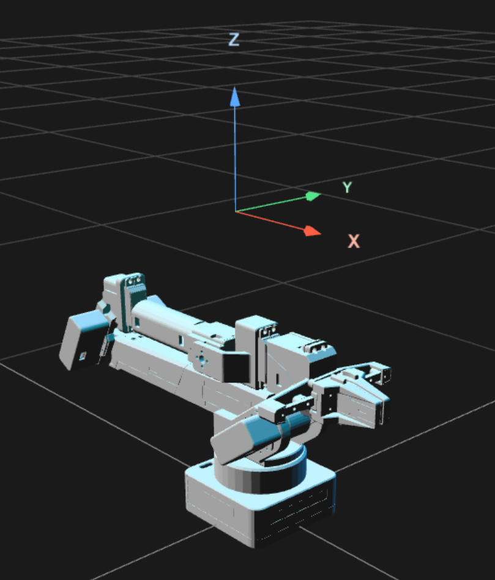
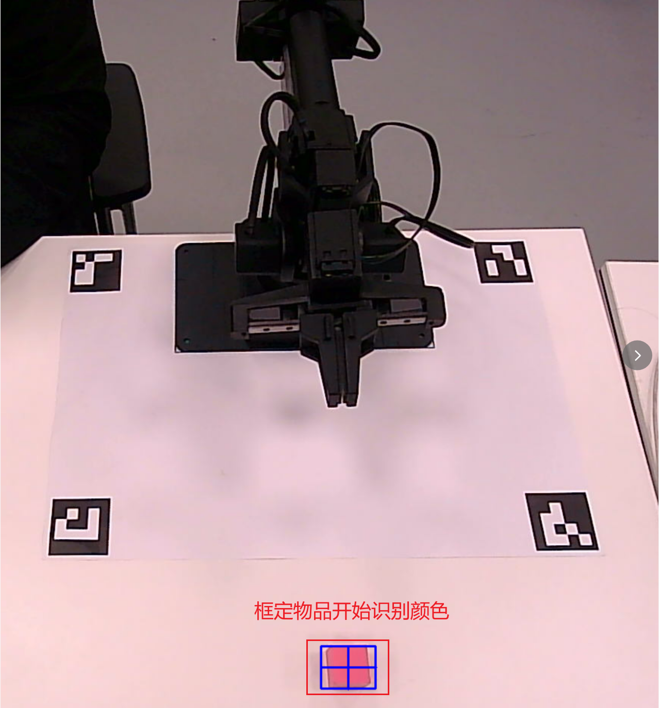
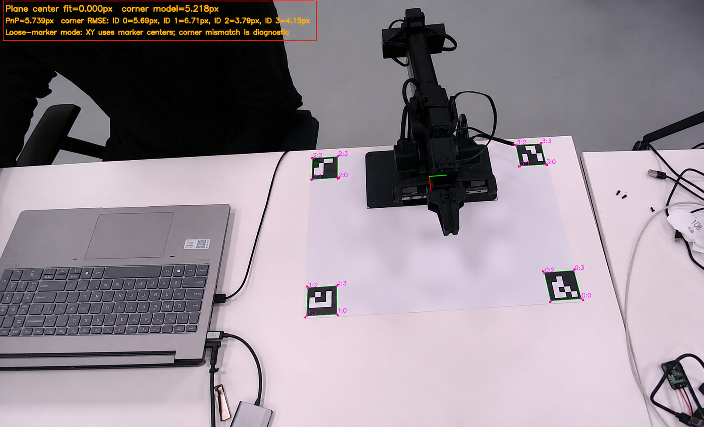
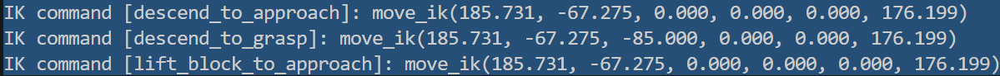
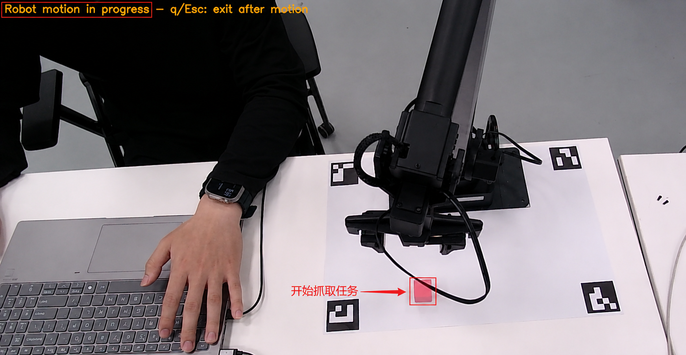

# 摄像头抓取案例

本案例把视觉识别、固定相机 PnP 平面映射和机械臂控制串联起来，使机械臂能够从相机画面中识别指定颜色的物块，并完成抓取、搬运、放置和复位。

案例采用固定 RGB 相机的 eye-to-hand 方案，也就是将相机固定在机械臂外部，从上方持续观察整个工作区域。程序先在相机画面中找到物块，再把图像位置换算成机械臂能够执行的空间位置。

理解本案例前，可以先认识几个会反复出现的概念：

- **ArUco Marker**：带有唯一编号的黑白方形标记，为程序提供位置已知的参考点。
- **PnP**：根据参考点在真实空间和相机画面中的对应关系，估计相机观察工作平面的角度和位置。
- **固定相机平面映射**：通过 ArUco Marker 和 PnP 建立相机画面与机械臂坐标之间的联系，让机械臂知道画面中的目标实际位于哪里。
- **`base_link`**：以机械臂底座为基准建立的坐标系，是本案例描述抓取位置的统一参照。
- **IK（逆运动学）**：根据目标位置和姿态，计算并控制机械臂运动到目标处。

这些概念最终服务于同一个目标：把“相机看到的物块”转换成“机械臂可以到达的抓取位置”。本文重点介绍案例的组成、实验主线和关键观察点，具体算法和参数由学习者结合项目 README、配置文件和源码继续探索。

下面两张图分别展示实验的硬件场景和功能流程。固定相机从机械臂上方观察工作区，程序先识别物块，再利用标定结果完成坐标转换，最后控制机械臂执行抓取任务。

<table>
  <tr>
    <td width="34%" align="center" valign="top">
      
      <br>
      <strong>实验场景：</strong>固定相机覆盖机械臂、标定板和抓取区域。
    </td>
    <td width="66%" align="center" valign="top">
      
      <br>
      <strong>案例流程：</strong>视觉识别、固定相机平面映射与机械臂抓取依次传递任务数据。
    </td>
  </tr>
</table>

## 目标效果

完成本案例后，可以观察到以下完整工作过程：

```text
选择目标颜色
  → 检测标定板 Marker
  → 建立相机与 base_link 的坐标映射
  → 识别物块中心位置和方向
  → 计算机械臂抓取坐标
  → 执行抓取、搬运、放置和复位
```

案例首次启动时完成目标颜色确认和固定相机平面标定，第一次抓取结束后程序继续运行。将同一颜色的物块移动到新位置并按下空格键，可以复用当前颜色模型和标定结果继续抓取。

本案例涉及的重点知识包括：

- 从相机画面中获得目标物的位置和方向。
- 使用 ArUco Marker 建立图像与机械臂工作平面的对应关系。
- 区分图像坐标、标定板坐标和机械臂 `base_link` 坐标。
- 将视觉计算结果交给机械臂逆运动学接口执行。
- 将识别、抓取、搬运、放置和复位组织成完整任务。

## 需要准备

**硬件与场景**

- 一台已经完成 [快速上手](../02_快速上手/README.md) 的 ZYArm 机械臂。
- 一台能够固定安装并覆盖工作区的 RGB 摄像头。
- ArUco 标定板及其打印 PDF。
- 一个颜色明显、尺寸适合夹爪抓取的轻质物块。
- 稳定桌面、相机支架、电源和连接线。
- 均匀、稳定且不会在 Marker 表面产生强反光的环境光。

相机、标定板和机械臂安装完成后，应保证四个 Marker、目标物块和主要抓取区域都位于相机视野内。相机、标定板或机械臂底座在标定后不应再发生移动。

**软件环境**

- Python 与 OpenCV。
- ZYArm Python SDK。
- 本案例依赖与源码。

项目依赖及运行方式见 [固定 RGB 颜色块抓取案例说明](../../software/examples/camera_pick/fixed_rgb_color_pick/README.md)。

**标定板资料**



上图用于展示标定板、Marker 和 `base_link` 原点的场景关系。实际打印文件可以从下面的链接下载：

[下载 ZYArm Eye-to-Hand ArUco Calibration Board（A3 PDF）](../assets/Downloads/zyarm-eye-to-hand-aruco-calibration-board-a3.pdf)

打印时请选择 **A3 纸张、实际大小或 100% 比例**，不要使用“适合页面”或其他自动缩放选项。打印完成后先测量单个 Marker 的黑色外框，确认尺寸为 `50 × 50 mm`（打印与实际尺寸存在轻微误差）。

| 项目 | 参数 |
| --- | --- |
| 打印纸张 | A3，`297 × 420 mm` |
| 标定板有效范围 | `420 × 297 mm` |
| 单个 Marker 尺寸 | `50 × 50 mm` |
| `base_link` 原点到 X 方向两侧边界 | 各 `210 mm` |
| `base_link` 原点到 Y 正方向边界 | `239.5 mm` |
| `base_link` 原点到 Y 负方向边界 | `57.5 mm` |
| 标定平面高度 | `Z = 0 mm` |

布置时，标定板、机械臂底座和桌面需要以同一稳定水平面为基准：标定板应平整贴合桌面，机械臂底座应稳定放置且不能倾斜。这里强调的是三者的水平基准保持一致，不是要求机械臂底座上表面与标定板处于相同高度。

Marker 的编码、ID 布局和空间坐标必须与 [config/fixed_rgb_color_pick.py](../../software/examples/camera_pick/fixed_rgb_color_pick/config/fixed_rgb_color_pick.py) 保持一致，不能通过随意交换 Marker ID 修正机械臂坐标方向。

## 推荐入口

本案例位于：

```text
software/examples/camera_pick/fixed_rgb_color_pick/
```

学习者不需要一开始阅读所有实现，可以先按照下表理解各个文件负责解决什么问题：

| 模块 | 在实验中的作用 | 推荐阅读入口 |
| --- | --- | --- |
| 案例说明 | 介绍依赖安装、启动方式和基础使用要求 | [README.md](../../software/examples/camera_pick/fixed_rgb_color_pick/README.md) |
| 实验配置 | 集中管理相机、标定板、抓取高度和放置位置等参数 | [config/fixed_rgb_color_pick.py](../../software/examples/camera_pick/fixed_rgb_color_pick/config/fixed_rgb_color_pick.py) |
| 视觉识别 | 打开相机、确认目标颜色并寻找物块的位置和方向 | [src/color_block_vision.py](../../software/examples/camera_pick/fixed_rgb_color_pick/src/color_block_vision.py) |
| 固定相机标定 | 检测 Marker，建立图像位置到 `base_link` 坐标的映射 | [src/fixed_camera_calibration.py](../../software/examples/camera_pick/fixed_rgb_color_pick/src/fixed_camera_calibration.py) |
| 任务控制 | 组合识别与标定结果，控制机械臂完成抓取、放置和复位 | [src/fixed_color_pick_controller.py](../../software/examples/camera_pick/fixed_rgb_color_pick/src/fixed_color_pick_controller.py) |
| 分层测试 | 分别验证视觉、标定和控制流程，帮助定位实验问题 | [tests](../../software/examples/camera_pick/fixed_rgb_color_pick/tests) |

三个核心模块之间的关系可以概括为：

```text
视觉识别：物块在画面中的位置和方向
        ↓
固定相机标定：转换成 base_link 下的目标坐标
        ↓
任务控制：调用 ZYArm SDK 完成抓取和放置
```

## 推荐流程

下面的主线图给出了完整实验从场景准备到结果分析的九个阶段。学习时可以先理解整条主线，再按照各步骤完成操作和观察。



> 主线图用于帮助理解实验阶段和先后关系，其中机械臂与界面采用简化示意，实际设备布置和运行画面以各步骤的实拍图片为准。

### 1. 布置实验场景

**怎么做**

将机械臂固定在稳定桌面上，把标定板平整贴合桌面并按照前文尺寸与 `base_link` 对齐，再将 RGB 相机固定在机械臂上方。调整相机高度和角度，使四个 Marker、目标物块及主要抓取区域都位于画面中。


**观察重点**

- 相机应覆盖完整标定板和抓取区域。
- 标定板不能弯曲，Marker 表面不能出现强反光。
- 标定板、机械臂底座和桌面应保持一致的水平基准。
- 相机支架、机械臂底座和标定板在标定后不能移动。
- 电源线和相机线不能进入机械臂运动范围。

**为什么这样做**

固定相机平面标定描述的是相机、标定板和机械臂之间的固定空间关系。任何一个部件发生移动，原来的坐标映射都可能失效。

### 2. 认识机械臂坐标系

**怎么做**

结合下图认识机械臂的 `base_link` 坐标系。本案例中，X 轴指向机械臂前方，Y 轴指向机械臂左侧，Z 轴竖直向上。后续计算出的物块位置都会转换到这个坐标系中。



**观察重点**

- 物块前后移动时，X 坐标应产生主要变化。
- 物块左右移动时，Y 坐标应产生主要变化。
- 抓取高度和安全高度由 Z 坐标描述。

**为什么这样做**

相机画面使用以像素为单位的二维坐标，机械臂使用以毫米为单位的空间坐标。先明确 `base_link` 的方向，才能判断坐标转换和机械臂运动是否正确。

### 3. 检查实验配置（如果使用配套相机则无需检查，使用默认配置即可）

**怎么做**

打开 [config/fixed_rgb_color_pick.py](../../software/examples/camera_pick/fixed_rgb_color_pick/config/fixed_rgb_color_pick.py)，确认摄像头设备、采集分辨率、相机内参、Marker 空间坐标、抓取高度和放置位置与当前场景一致。

在仓库根目录启动案例：

```bash
python software/examples/camera_pick/fixed_rgb_color_pick/src/fixed_color_pick_controller.py --port COM3
```

其中 `COM3` 需要替换为机械臂实际使用的串口。

**观察重点**

- 摄像头编号是否能够打开正确的相机。
- Marker ID、实际位置和配置坐标是否一致。
- 抓取高度与放置位置是否处于机械臂安全工作范围。

**为什么这样做**

配置文件是程序对真实实验环境的描述。参数与现场不一致时，即使识别和标定能够运行，机械臂仍可能到达错误位置。

### 4. 完成视觉识别

**怎么做**

程序打开相机后，在画面中框选目标物块内部颜色均匀的区域，按空格键或回车键确认。尽量避开物块边缘、阴影、反光和桌面背景。



图中处于目标颜色确认阶段。确认后，程序会继续寻找同一颜色的物块，并计算物块的轮廓、中心位置和方向。

**观察重点**

- 框选区域应主要包含目标颜色。
- 检测框应稳定覆盖物块，而不是桌面或标定板。
- 物块静止时，中心点和方向不应明显跳变。

**为什么这样做**

颜色确认相当于告诉程序“本次要寻找什么物体”。稳定的目标颜色模型能够减少背景、阴影和其他物体带来的误识别。

**源码阅读**

- `select_color_roi()`：根据框选区域建立目标颜色模型。
- `detect_stable()`：寻找位置和方向足够稳定的目标物块。

### 5. 完成固定相机平面标定

**怎么做**

保持相机、标定板和机械臂静止，确保四个 Marker 都完整、清晰地出现在画面中。程序会连续采集多帧 Marker 位置，在稳定样本满足要求后完成标定。



图中彩色框和编号表示 Marker 及其角点检测结果，机械臂底座附近的红、绿坐标轴表示 `base_link` 的 X、Y 方向；左上角显示平面拟合、PnP 和各 Marker 角点误差等标定质量指标。

**观察重点**

- 四个 Marker 是否都能持续识别。
- Marker ID 是否与配置中的位置对应。
- 稳定样本数量是否持续增加。
- 重投影误差或平面拟合误差是否通过程序检查。

**为什么这样做**

Marker 为程序提供位置已知的参考点，PnP 根据这些参考点建立相机和工作平面的空间关系。完成这一步后，程序才能把图像中的像素位置转换为机械臂坐标。

**源码阅读**

从 `calibrate_stable()` 入手，了解程序如何收集稳定 Marker 样本并建立坐标映射。

> 本案例中的标定是固定相机 eye-to-hand 场景下，利用 ArUco Marker 和 PnP 建立相机与工作平面的映射，不是经典的多姿态 `AX=XB` 标定流程。

### 6. 生成机械臂目标

**怎么做**

标定完成后，程序把物块中心从图像坐标转换到 `base_link` 坐标，并把物块方向转换为夹爪的目标角度。终端会打印即将发送给机械臂的 IK 指令。



示例中三条指令保持相同的 X、Y 和末端方向，只改变 Z 高度，依次完成接近、下放抓取和重新提升。

**观察重点**

- X、Y 是否与物块在真实场景中的前后、左右位置一致。
- 接近高度、抓取高度和提升高度是否符合配置。
- Yaw 是否与物块方向和夹爪姿态一致。

**为什么这样做**

机械臂不能直接使用相机中的像素坐标。生成目标的过程把视觉结果整理成机械臂能够理解和执行的位置与姿态。

**源码阅读**

从 `build_pick_target()` 入手，了解物块中心和方向如何转换成统一的抓取目标。

### 7. 执行抓取任务

**怎么做**

确认人员和杂物离开机械臂工作区后，让程序执行抓取。机械臂会依次完成打开夹爪、移动到安全高度、下降抓取、闭合夹爪、提升、移动到放置点、松开夹爪和复位。



**观察重点**

- 机械臂是否先到达安全高度，再垂直下降。
- 夹爪闭合时是否对准物块中心。
- 提升和搬运过程中物块是否稳定。
- 实时相机画面是否在机械臂运动期间持续刷新。

**为什么这样做**

把抓取拆分为接近、下放、夹取、提升和放置等阶段，可以减少夹爪横向碰撞物块、桌面或标定板的风险。

**源码阅读**

从 `execute_pick()` 入手，了解程序如何组织完整的抓取与放置动作。

> **安全提示：**机械臂运动期间不要把手伸入工作区。需要调整物块时，应等待机械臂完成动作并停止。

### 8. 进行重复抓取

**怎么做**

第一次任务结束后，将同一颜色的物块移动到抓取区域内的新位置。确认手离开工作区后按空格键，程序会重新识别物块并执行下一次抓取。

**观察重点**

- 第二次任务不会重新选择目标颜色。
- 相机、标定板和机械臂未移动时，不需要重新标定。
- 物块移动到不同位置后，输出的 X、Y 坐标应随之变化。

**为什么这样做**

重复抓取用于验证颜色模型和标定结果能否在同一固定场景中复用，也能够观察系统对工作区域内不同目标位置的适应能力。

**源码阅读**

从 `wait_for_next_cycle()` 入手，了解程序如何等待空格键并进入下一次识别和抓取。

### 9. 观察与分析结果

**怎么做**

结合相机检测画面、终端目标坐标、IK 指令和机械臂实际到达位置，判断整个流程是否一致。出现偏差时，先确定问题属于视觉识别、固定相机标定、坐标方向还是动作参数。

**建议思考**

- 物块向机械臂前方移动时，哪个坐标发生主要变化？
- 物块向左移动时，坐标变化是否符合 `base_link` 定义？
- 抓取偏差是始终朝同一方向，还是每次随机变化？
- 相机或标定板移动后，原有标定结果为什么不能继续使用？

**为什么这样做**

实验的目标不只是完成一次抓取，还要能够根据现象判断问题来自哪个模块，并通过调整场景、配置或参数逐步提高稳定性。

## 成功现象

- **场景与画面：**摄像头画面稳定，能够覆盖四个 Marker、目标物块和抓取区域。
- **视觉识别：**程序能够确认目标颜色，并稳定输出物块中心和方向。
- **固定相机标定：**四个 Marker 能够持续检测，标定结果通过程序的质量检查。
- **坐标转换：**物块前后、左右移动时，输出坐标变化符合 `base_link` 定义。
- **抓取动作：**机械臂能够完成接近、抓取、提升、搬运、放置和复位。
- **重复运行：**第一次任务完成后程序保持运行，按空格键可以继续识别和抓取。
- **实验安全：**整个过程没有碰撞桌面、相机支架、标定板或线材。

## 场景记录表

学习者可以使用下表记录自己的实验场景和观察结果。未给出的参数可结合源码、实际测量和实验现象自行补充。

| 项目 | 记录 |
| --- | --- |
| 机械臂端口 |  |
| 摄像头安装位置 |  |
| Marker 尺寸与间距 |  |
| 物块尺寸与颜色 |  |
| 标定质量或误差提示 |  |
| 抓取与放置参数 |  |
| 第一次抓取结果 |  |
| 重复抓取结果 |  |
| 观察与改进 |  |
