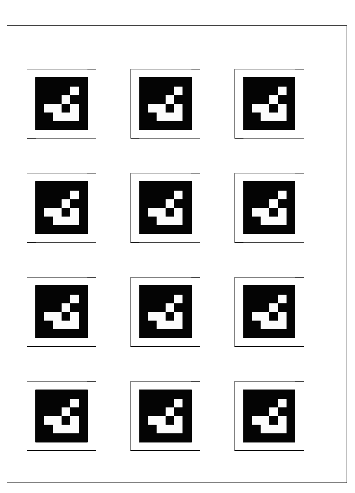

# 腕部相机 ArUco 抓取案例

本案例使用安装在末端夹爪附近的 RGB 摄像头，识别贴在小方块顶部的 ArUco Marker，并根据 Marker 的实际尺寸计算抓取位置。程序会从固定观察姿态开始识别目标，换算到机械臂 `base_link` 坐标系后，控制机械臂完成抓取、放置和复位。

它和 [摄像头抓取案例](05_摄像头抓取案例.md) 不是同一种模型。固定相机案例把相机放在机械臂外部，ArUco 是标定板，目标靠颜色识别；本案例把相机装在夹爪附近，ArUco 贴在目标方块上，目标本身就是 Marker。


## 目标效果

完成本案例后，可以观察到以下流程：

```text
移动到固定观察姿态 observe_pose
  -> 腕部相机识别目标方块上的 ArUco
  -> 根据 ArUco 四个角和实际边长估计目标相对相机的位置
  -> 将目标位置换算到机械臂 base_link 坐标系
  -> 叠加抓取补偿，生成夹爪目标位置
  -> 按 SPACE 执行抓取和放置
  -> 回到 observe_pose，等待下一次 SPACE
  -> 按 q 或 Esc 退出并复位
```

本案例适合验证“摄像头跟随机械臂末端移动”的视觉抓取方式。它不需要固定外部相机覆盖整个工作区，也不需要在桌面上铺设完整 ArUco 标定板。

## 和固定相机案例有什么不同

| 对比项 | 固定 RGB 颜色块抓取 | 腕部 RGB ArUco 抓取 |
| --- | --- | --- |
| 示例目录 | `fixed_rgb_color_pick/` | `wrist_rgb_aruco_pick/` |
| 相机位置 | 机械臂外部固定安装 | 末端夹爪附近安装 |
| 目标识别 | 颜色块检测 | 目标方块上的 ArUco |
| ArUco 作用 | 工作平面标定参考点 | 被抓目标的位置参考 |
| 坐标模型 | 固定相机到工作平面的映射 | OpenCV 相机系到夹爪和 `base_link` 的链路换算 |
| 重复运行 | 复用颜色模型和标定结果 | 每轮重新识别目标 ArUco |

如果你想理解固定相机、标定板和颜色块识别，请先看 [摄像头抓取案例](05_摄像头抓取案例.md)。如果你的相机已经安装在夹爪附近，或者你希望目标自带可识别标记，本页更贴近当前实验。

## 工作原理

### ArUco 提供可识别的目标坐标

ArUco Marker 是一个带有唯一 ID 的黑白方形标记。程序可以从图像中检测出它的四个角点，并确认它是不是配置中指定的目标 ID。

本案例默认识别 ID 为 `0` 的 Marker。Marker 的实际边长需要写入配置，例如 `30.0 mm`。这里的尺寸应以黑色 Marker 外框边长为准，而不是整张纸、白边或贴纸的外框。

### solvePnP 根据四个角估计位置

程序知道两件事：

- ArUco 四个角在真实 Marker 平面上的相对位置。
- ArUco 四个角在摄像头画面中的像素位置。

OpenCV 的 `solvePnP` 会根据这两组对应关系，估计 Marker 相对相机的旋转和平移，也就是 `rvec` 和 `tvec`。其中 `tvec` 的单位和配置的 Marker 边长一致，配置使用毫米时，输出也按毫米理解。

```text
图像中的四个角点 + Marker 实际边长 + 相机内参
  -> solvePnP
  -> marker 相对 OpenCV 相机坐标系的 rvec / tvec
```

### 坐标从相机转换到机械臂

OpenCV 给出的坐标还不是机械臂能直接使用的坐标。程序会按配置描述的坐标链路逐步转换：

```text
OpenCV 相机坐标系
  -> 摄像头机械坐标系
  -> 夹爪末端坐标系
  -> 机械臂 base_link 坐标系
```

启用 3D 外参时，核心关系可以理解为：

```text
p_B_M = p_B_T + R_B_T * (p_T_C + R_T_C * R_C_O * p_O_M)
```

其中：

| 符号 | 含义 |
| --- | --- |
| `p_O_M` | Marker 在 OpenCV 相机坐标系下的位置，由 `solvePnP` 得到 |
| `R_C_O` | OpenCV 相机坐标系到摄像头机械坐标系的轴向转换 |
| `p_T_C / R_T_C` | 摄像头相对夹爪末端的安装平移和旋转 |
| `p_B_T / R_B_T` | 固定观察姿态 `observe_pose` 在 `base_link` 下的位置和姿态 |
| `p_B_M` | Marker 在机械臂 `base_link` 坐标系下的位置 |

这也是为什么摄像头不一定要垂直桌面。只要相机和夹爪之间的安装关系配置正确，程序就可以覆盖带倾角安装的场景。

### 为什么每轮都回到 observe_pose

本案例采用固定观察姿态模型。每次抓取前，机械臂先移动到配置中的 `observe_pose`，再读取相机画面并计算目标位置。

这样做可以把问题简化很多：识别时机械臂姿态固定，相机和机械臂基坐标之间的关系也固定。它不是任意机械臂姿态下的完整在线手眼标定，而是一个更容易复现、更适合教学和实验验证的实用模型。

### 为什么需要抓取补偿

视觉计算得到的是 Marker 或方块中心位置，但夹爪真正稳定夹住物体的位置还会受到这些因素影响：

- ArUco 是否贴在方块正中心。
- 夹爪夹持中心和 Marker 中心是否重合。
- 摄像头安装位置和角度的人工测量误差。
- 机械臂执行 `move_ik()` 时的回差和末端安装偏差。

因此配置中提供了：

```yaml
mapping:
  grasp_offset_base_xy_mm: [-35.0, -20.0]
```

这个补偿值是在 `base_link` 坐标系下对最终抓取点做的微调。只要不同位置的抓取偏差比较稳定，就可以用它把实际夹取点调到更可靠的位置。

## 需要准备

**硬件与场景**

- 一台已经完成 [快速上手](../02_快速上手/README.md) 的 ZYArm 机械臂。
- 一台安装在末端夹爪附近的 RGB 摄像头。
- 一个顶部贴有 ArUco Marker 的小方块。
- 稳定桌面、电源和连接线。
- 可以随时切断机械臂电源的安全方式。

**Marker 要求**

- 使用配置中指定的 ArUco 字典和 ID。
- 默认目标 ID 为 `0`。
- 默认 Marker 黑色外框边长为 `30 mm`。
- 可以直接使用 A4 打印文件：[下载 ArUco 0 30 mm × 30 mm 打印 PDF](../assets/Downloads/ArUco_0_30_30.pdf)。
- 打印时请选择 A4 纸张、实际大小或 100% 比例，不要使用“适合页面”或其他自动缩放选项。
- 打印后建议用尺子测量黑色外框，确认接近 `30 mm × 30 mm`。
- Marker 应平整贴在方块顶部，表面尽量避免反光和明显弯折。

**软件环境**

- Python 与 OpenCV。
- ZYArm Python SDK。
- 本案例依赖与源码。

安装依赖：

```bash
python -m pip install -r software/examples/camera_pick/wrist_rgb_aruco_pick/requirements.txt
python -m pip install -e software/zyarm_sdk/python
```

项目依赖及详细参数见 [腕部 RGB ArUco 抓取示例说明](../../software/examples/camera_pick/wrist_rgb_aruco_pick/README_CN.md)。

## 推荐入口

本案例位于：

```text
software/examples/camera_pick/wrist_rgb_aruco_pick/
```

学习者可以先按下表理解每个文件负责什么：

| 模块 | 在实验中的作用 | 推荐阅读入口 |
| --- | --- | --- |
| 案例说明 | 介绍依赖安装、配置、运行方式和安全边界 | [README_CN.md](../../software/examples/camera_pick/wrist_rgb_aruco_pick/README_CN.md) |
| 实验配置 | 管理相机、Marker、观察姿态、放置姿态、坐标映射和安全高度 | [config/wrist_rgb_aruco_pick.yaml](../../software/examples/camera_pick/wrist_rgb_aruco_pick/config/wrist_rgb_aruco_pick.yaml) |
| 纯视觉检测 | 只打开图片或摄像头，检测 ArUco 并显示 overlay | [detect_aruco_block.py](../../software/examples/camera_pick/wrist_rgb_aruco_pick/detect_aruco_block.py) |
| 抓放入口 | 连接相机和机械臂，执行连续抓取和放置 | [pick_aruco_block.py](../../software/examples/camera_pick/wrist_rgb_aruco_pick/pick_aruco_block.py) |
| ArUco 视觉 | 检测 Marker、计算 `rvec/tvec` 和重投影误差 | [src/aruco_vision.py](../../software/examples/camera_pick/wrist_rgb_aruco_pick/src/aruco_vision.py) |
| 坐标映射 | 将 `solvePnP` 结果换算成 `base_link` 下的目标位置 | [src/pose_mapping.py](../../software/examples/camera_pick/wrist_rgb_aruco_pick/src/pose_mapping.py) |
| 任务控制 | 组织观察、等待 SPACE、抓取、放置、复位和退出 | [src/pick_controller.py](../../software/examples/camera_pick/wrist_rgb_aruco_pick/src/pick_controller.py) |
| 分层测试 | 验证视觉、配置、映射、动作顺序和错误阻断 | [tests](../../software/examples/camera_pick/wrist_rgb_aruco_pick/tests) |

## 配置重点

打开：

```text
software/examples/camera_pick/wrist_rgb_aruco_pick/config/wrist_rgb_aruco_pick.yaml
```

重点检查这些字段：

| 配置项 | 作用 |
| --- | --- |
| `camera.index` | 选择使用哪个摄像头 |
| `camera.camera_matrix` | 相机内参，影响 `solvePnP` 估计位置 |
| `camera.dist_coeffs` | 相机畸变参数 |
| `marker.id` | 需要识别的 ArUco ID |
| `marker.size_mm` | Marker 黑色外框实际边长 |
| `observe_pose` | 每轮识别开始前机械臂进入的固定观察姿态 |
| `place_pose` | 抓取成功后的固定放置姿态 |
| `mapping.camera_to_tool` | 摄像头相对夹爪末端的安装平移和旋转 |
| `mapping.opencv_to_camera` | OpenCV 相机坐标系到摄像头机械坐标系的轴向转换 |
| `mapping.grasp_offset_base_xy_mm` | 根据实际抓取偏差做的 XY 补偿 |
| `mapping.max_xy_offset_mm` | 允许的最大目标偏移，避免明显异常位置继续动作 |
| `task.safe_z_mm` | 移动到目标上方时使用的安全高度 |
| `task.grasp_z_mm` | 夹爪下降抓取时使用的高度 |
| `loop.max_cycles` | 最大抓放轮数，`null` 表示持续等待用户触发 |

如果使用配套实验装置，可以先使用默认配置。更换摄像头、安装角度、观察姿态或方块尺寸后，需要重新检查对应配置。

## 运行步骤

### 1. 安装并检查腕部相机

将 RGB 摄像头固定在夹爪附近，确保线材不会进入关节、底座或夹爪运动范围。移动机械臂前，先手动观察线材是否会被拉扯。

摄像头可以带一定倾角，不要求垂直桌面。但安装位置和角度确定后，应保持稳定，不要在实验过程中晃动或重新固定。

### 2. 准备 ArUco 方块

可以使用前文提供的 A4 PDF 打印 ArUco 0。打印后先测量黑色外框尺寸，再裁剪并贴到小方块顶部。建议先使用轻质、规则、夹爪容易夹住的小方块。Marker 尽量贴在方块中心附近，方向可以不完全对齐桌面边缘。



### 3. 确认相机能识别 Marker

可以先运行纯视觉检测入口，只确认相机画面和 ArUco 识别：

```bash
python software/examples/camera_pick/wrist_rgb_aruco_pick/detect_aruco_block.py --camera 1 --show
```

如果你的摄像头编号不是 `1`，需要替换为实际编号，或在配置文件中修改 `camera.index`。

**观察重点**

- 窗口中能看到方块顶部的 ArUco。
- overlay 能稳定标出 Marker 边框、ID、坐标轴和误差。
- 移动方块时，识别结果不会频繁丢失。
- 光照变化或反光不会让 Marker 边缘变得模糊。

### 4. 检查配置参数

打开腕部 ArUco 抓取配置文件：

```text
software/examples/camera_pick/wrist_rgb_aruco_pick/config/wrist_rgb_aruco_pick.yaml
```

确认 `observe_pose`、`place_pose`、`marker.size_mm`、`camera_to_tool` 和抓取高度符合当前实验装置。

这里最容易出错的是 Marker 尺寸和抓取高度：

- `marker.size_mm` 应填写黑色 Marker 外框边长。
- `task.safe_z_mm` 应保证横向移动时不会碰到方块和桌面物品。
- `task.grasp_z_mm` 应让夹爪能夹住方块，但不能撞击桌面。

### 5. 运行真机抓放

确认人员和杂物离开机械臂工作区后，在仓库根目录运行：

```bash
python software/examples/camera_pick/wrist_rgb_aruco_pick/pick_aruco_block.py --port COM9
```

其中 `COM9` 需要替换为当前机械臂实际串口。

程序启动后会移动到 `observe_pose`，持续显示相机画面。识别到可用目标后，按 `SPACE` 执行一次抓取和放置。抓放完成后，程序会回到 `observe_pose` 并继续等待下一次 `SPACE`。

按 `q` 或 `Esc` 正常退出时，程序会先调用 `reset()` 复位，再关闭相机和机械臂连接。

### 6. 根据偏差微调抓取补偿

如果机械臂每次都偏向同一个方向，优先调整：

```yaml
mapping:
  grasp_offset_base_xy_mm: [x_offset, y_offset]
```

这里的方向使用机械臂 `base_link` 坐标系：


- X 正方向：机械臂前方。
- Y 正方向：机械臂左侧。
- Z 正方向：竖直向上。

`grasp_offset_base_xy_mm` 只调整水平面内的 X/Y 补偿，高度仍由 `task.safe_z_mm` 和 `task.grasp_z_mm` 控制。

例如，如果每次都多往前抓 `10 mm`，可以把 X 补偿减少 `10 mm`。如果每次都偏左 `5 mm`，可以把 Y 补偿减少 `5 mm`。

**不要急着改相机外参。** 如果抓取偏差在不同位置基本一致，通常先用 `grasp_offset_base_xy_mm` 修正更快、更稳。

## 可选调试方法

如果更换了摄像头、调整了安装角度、修改了 `observe_pose`，可以先运行 dry-run 查看计划坐标：

```bash
python software/examples/camera_pick/wrist_rgb_aruco_pick/pick_aruco_block.py --dry-run
```

dry-run 会打开相机、识别 ArUco 并打印计划动作，但不会连接机械臂串口，也不会移动真实机械臂。

它适合用来观察：

- `delta_camera_xy` 是否随方块移动变化。
- `delta_base_xy` 是否大致符合 `base_link` 方向。
- 目标上方安全位置是否明显越界。
- `place_pose` 是否仍是期望的放置位置。

对于已经验证过的固定装置，日常运行不需要每次都先 dry-run。

## 成功现象

- 相机画面稳定，ArUco 能持续识别。
- 程序只响应配置中指定的 Marker ID。
- 方块放在不同位置时，机械臂会重新识别并重新计算抓取位置。
- 按 `SPACE` 后机械臂先移动到目标上方安全高度，再下降抓取。
- 抓取后能够移动到 `place_pose` 放置，并回到 `observe_pose`。
- 抓放完成后程序不退出，可以继续移动方块并按 `SPACE` 执行下一轮。
- 按 `q` 或 `Esc` 正常退出时，机械臂会执行复位。

## 常见问题

**识别不到 ArUco**

先确认 Marker ID、字典和打印质量。Marker 需要完整出现在画面中，边缘不能被手指、夹爪或反光遮挡。

**估计距离或位置明显不对**

优先检查 `marker.size_mm` 是否填写的是黑色 Marker 外框边长，再检查相机内参和畸变参数。打印缩放错误会直接影响 `solvePnP` 的毫米级估计。

**机械臂朝大致正确方向移动，但抓取有固定偏差**

优先调整 `grasp_offset_base_xy_mm`。这通常是夹爪中心、Marker 粘贴位置和机械安装误差叠加造成的固定补偿问题。

**只有画面中心附近准确，边缘误差变大**

可能是相机内参、畸变参数或安装外参不够准确。可以先缩小工作区域，确认中心区域稳定后再重新标定相机或测量安装外参。

**按 `q` 或 `Esc` 后不是立即停止**

`q` 和 `Esc` 是正常退出流程，会等待当前动作结束后复位并关闭程序。它不是硬实时急停。出现危险时，应使用机械臂硬件安全方式或直接切断电源。

## 场景记录表

建议记录每次实验装置和调参结果，方便下次复现。

| 项目 | 记录 |
| --- | --- |
| 机械臂端口 |  |
| 摄像头编号 |  |
| 摄像头安装位置与角度 |  |
| Marker 字典与 ID |  |
| Marker 黑色外框尺寸 |  |
| `observe_pose` |  |
| `place_pose` |  |
| `camera_to_tool` |  |
| `grasp_offset_base_xy_mm` |  |
| `safe_z_mm / grasp_z_mm` |  |
| 第一次抓取结果 |  |
| 连续抓取结果 |  |
| 观察与改进 |  |
