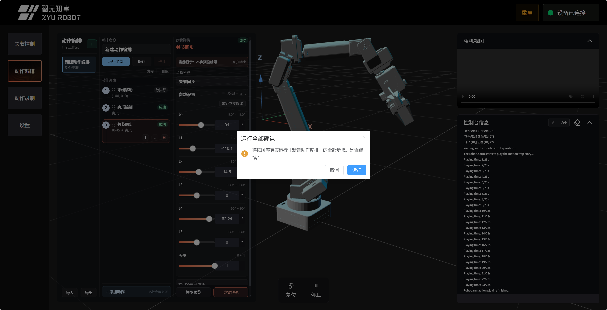
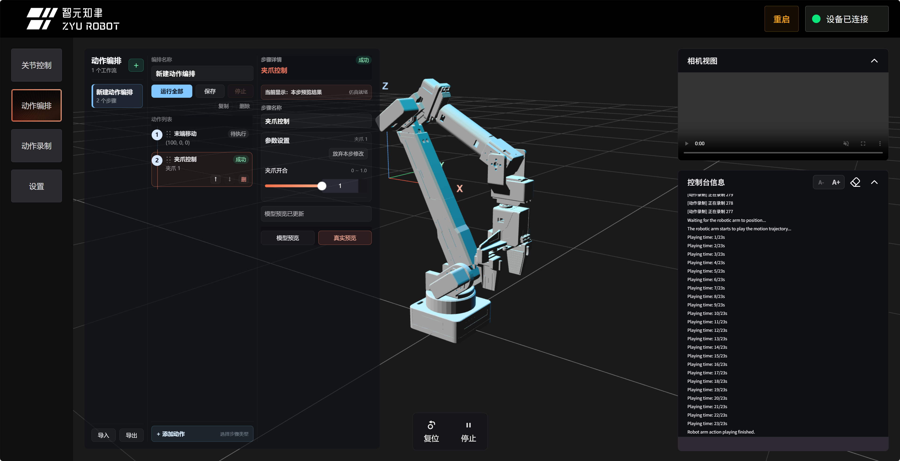
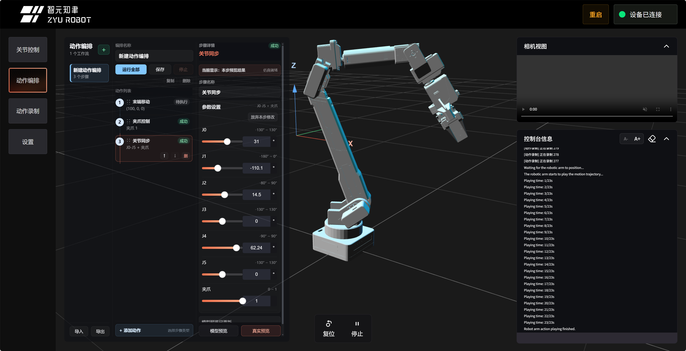
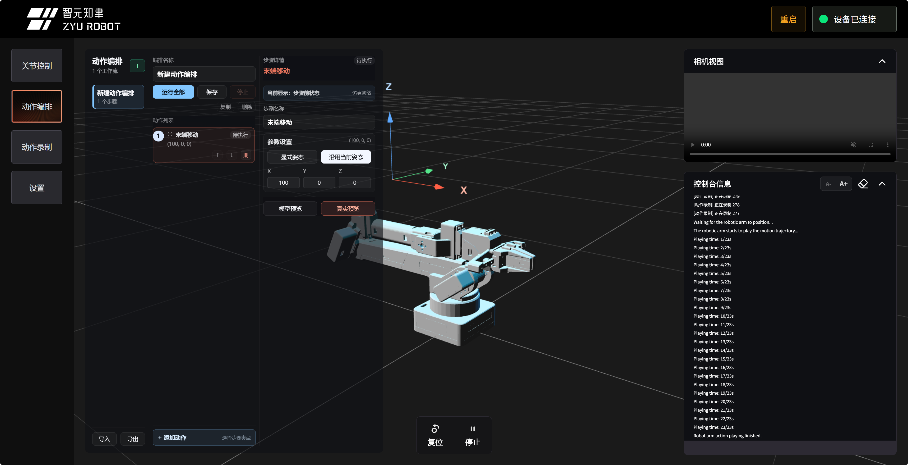

# Web 动作编排工作流

动作编排适合把一组机械臂动作整理成“可保存、可复用、可调参”的流程。例如：

```text
移动到取料点
  -> 打开夹爪
  -> 关节姿态微调
  -> 闭合夹爪
  -> 等待 1 秒
  -> 移动到放料点
  -> 打开夹爪
  -> 复位
```

它比单条串口命令更适合教学和项目演示：学习者可以看到每一步做什么、参数是什么、当前执行到哪里，出错时也能定位到具体步骤。

本页默认你已经完成 [Web 控制台入门](01_Web仿真体验.md)，并能通过官方 Web 控制台连接机械臂：

```text
https://arm.zyairobot.com/#/zy
```


## 先做一个低风险短流程

第一次不要从抓取、末端移动或多步项目开始。先做一个几乎不改变空间位置的短流程，确认你理解页面和运行方式。

推荐第一个编排：

```text
复位
  -> 等待 1000ms
  -> 夹爪控制：打开到 1.0
  -> 等待 1000ms
  -> 夹爪控制：回到 0.2
```

这个流程的好处是：动作幅度小、容易观察、失败后容易复位，也能让你熟悉“添加步骤、保存、真实预览、运行全部”的完整流程。

## 页面布局

动作编排页面分成三列：

| 区域 | 作用 |
| --- | --- |
| 编排列表列 | 新建、选择、导入和导出动作编排项目 |
| 编排详情列 | 修改编排名称，查看、添加、删除、排序动作步骤 |
| 参数设置列 | 修改当前选中步骤的参数，做模型预览或真实预览 |

这种布局比把所有内容堆在一列里更清楚：左边选“哪个流程”，中间选“哪一步”，右边改“这一步怎么做”。

## 新建第一个编排

1. 点击左侧编排列表顶部的 `+`。
2. 在中间列修改编排名称，例如 `safe_demo_01`。
3. 点击底部 `+ 添加动作`。
4. 先添加“复位”。
5. 再添加“等待”，参数填 `1000ms`。
6. 再添加“夹爪控制”，参数填一个小幅安全值。
7. 点击“保存”。

第一次只添加 3 到 5 个步骤。确认流程能运行后，再逐步加入末端移动和关节同步。

## 支持哪些步骤

| 步骤类型 | 说明 | 模型预览 | 真实执行 |
| --- | --- | --- | --- |
| 末端移动 | 设置末端目标 `X/Y/Z` 和姿态 `RX/RY/RZ` | 通过 IK 求解预览 | 发送真实 IK 运动指令 |
| 关节同步 | 直接设置 6 个关节和夹爪 | 实时更新模型 | 发送 `CMD3` 同步运动 |
| 夹爪控制 | 设置夹爪开合，范围 `0 ~ 1.0` | 实时更新模型 | 发送夹爪控制指令 |
| 等待 | 等待指定毫秒数 | 不改变模型 | 等待计时结束 |
| 复位 | 回到机械臂初始姿态 | 不连续预览 | 发送复位指令 |
| 播放录制 | 播放固件中保存的录制动作 | 不连续预览 | 发送播放录制指令 |
| 嵌套编排 | 在一个流程中调用另一个流程 | 按流程计算 | 顺序执行被调用流程 |

## 模型预览和真实执行

动作编排里有三个容易混淆的操作：

| 操作 | 会不会动真机 | 什么时候用 |
| --- | --- | --- |
| 调整参数 / 拖动滑块 | 不会 | 填写当前步骤草稿，观察模型状态 |
| 模型预览 | 不会 | 调参数、检查模型姿态、确认工作流前后状态 |
| 真实预览 | 会 | 单独执行当前步骤，验证机械臂真实动作 |
| 运行全部 | 会 | 按顺序执行整个编排 |

真实预览和运行全部都要当作真机动作处理。点击前检查机械臂周围空间、线材、夹爪附近和断电方式。



上图用于确认真实运行前会出现确认提示。看到确认框时，再做一次安全检查，不要把它当成普通弹窗随手点掉。

## 夹爪控制参数

夹爪控制适合作为第一个低风险步骤。它主要改变夹爪开合，不会让整条机械臂大范围移动。



第一次建议只在空载状态下测试夹爪，不要夹物体。确认开合方向和数值范围后，再用于录制动作或桌面任务。

## 关节同步参数

关节同步使用和“关节控制”页面一致的滑块风格。拖动滑块时，网页会更新当前步骤对应的模型预览，但不会立刻驱动真实机械臂。




关节同步步骤还可以“放弃修改”：如果你调参到一半发现不合适，可以恢复到这个步骤执行前的仿真状态。

第一次使用关节同步时，只轻微改变一个关节。不要一次调整多个关节，也不要把滑块拖到极限附近。

## 末端移动和 IK

末端移动支持两种姿态方式：

- `显式姿态`：填写 `RX/RY/RZ`，适合你已经知道目标姿态的情况。
- `沿用当前姿态`：只填写 `X/Y/Z`，姿态沿用当前仿真状态，适合新手先练习空间位置。



模型预览时，Web 会调用固件的“只 IK 求解不运动”命令，得到关节解后更新模型。如果目标点不可达，模型不会假装移动，步骤区域会提示 IK 失败或固件错误。

第一次练习末端移动时，建议：

- 使用“沿用当前姿态”。
- 一次只改变 `X` 或 `Z`。
- 坐标变化保持很小。
- 先模型预览，再真实预览。
- 真实预览通过后，再加入“运行全部”。

## 工作流如何运行

点击“运行全部”后，Web 会按顺序执行步骤：

```text
检查设备连接和安全确认
  -> 执行第 1 步
  -> 执行第 2 步
  -> ...
  -> 流程完成后回到可继续操作状态
```

运动类步骤必须收到固件完成 ACK 后才会进入下一步。`等待` 步骤才使用你填写的毫秒数。

如果某一步失败、超时、串口断开，或你点击“停止”，流程会中断，不会继续执行后面的步骤。

## 播放录制动作

如果你已经在 [动作录制与复现](02_动作录制与复现.md) 中保存了动作，可以在编排中添加“播放录制”步骤，把录制动作变成流程的一部分。

建议先单独确认录制动作安全，再放入编排。播放录制动作会驱动真实机械臂，不是模型预览。

## 排序、删除和导入导出

动作列表里的步骤可以上下拖动排序，也可以用按钮上移、下移或删除。调整顺序后，Web 会重新计算每一步之前和之后的仿真状态。

导入/导出用于备份动作编排项目：

- `导出`：把当前浏览器里的编排保存为项目文件，适合交作业、备份或迁移电脑。
- `导入`：读取项目文件并恢复编排列表。导入会替换当前浏览器里的编排列表，操作前请确认是否需要先导出备份。

## 一个完整示例

下面是一个适合课堂演示的简单流程：

| 步骤 | 参数建议 | 说明 |
| --- | --- | --- |
| 复位 | 无 | 回到安全起点 |
| 等待 | `1000ms` | 留出观察时间 |
| 夹爪控制 | `claw=1.0` | 空载打开夹爪 |
| 等待 | `1000ms` | 观察夹爪状态 |
| 关节同步 | 小幅度调整一个关节 | 观察模型和真机的对应关系 |
| 复位 | 无 | 结束后回到初始姿态 |

第一次真实运行时，建议每一步先点“真实预览”，确认没有碰撞，再运行全部。

## 常见问题

| 现象 | 可能原因 | 处理方式 |
| --- | --- | --- |
| 运行全部按钮不可用 | 没有连接设备或正在执行命令 | 先连接串口，等待当前命令结束 |
| 末端移动模型预览失败 | 目标点不可达或未连接设备做 IK 求解 | 改小位移，先用“沿用当前姿态” |
| 点击真实预览后终端报错 | 固件拒绝执行、参数越界或机械臂异常 | 保留终端信息，先复位再检查参数 |
| 调整步骤顺序后模型变化很大 | 前面步骤改变了后面步骤的起始状态 | 逐步点击每个步骤，确认“执行前/执行后”状态 |
| 想撤销某一步调参 | 当前步骤支持放弃修改 | 点击步骤里的“放弃修改”或重新选择步骤 |
| 真机动作异常 | 参数过大、碰撞、限位或线材干涉 | 先点击“停止”，无效时直接断电 |

## 安全建议

- 第一次运行工作流时，不要夹物体，只观察空载动作。
- 末端移动从小坐标变化开始，例如一次只改变 `X` 或 `Z`。
- 每个真实预览都当作真机动作处理，不要把手伸进运动范围。
- 工作流里加入夹爪动作前，先确认夹爪附近没有手指、线材或易碎物。
- 运行全部前先逐步真实预览关键步骤。
- 遇到异常动作先点“停止”，再考虑复位、硬件重启或直接断电。
