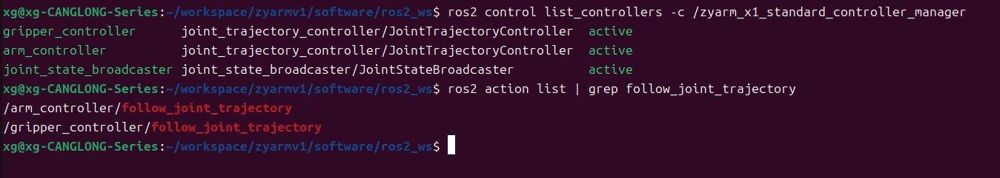

# ROS2 接入

本页面向第一次使用 ROS 2 路线的用户，说明每个启动入口做什么、启动后看什么、哪些入口会连接真机。ROS 2 可以理解成机器人软件系统的“工程骨架”，负责把模型显示、仿真、规划和真实机械臂控制组织在一起。ROS 2 路线推荐 Ubuntu 用户使用；第一次快速上手不要求安装 ROS 2。

先把本页必须出现的几个名字说清楚：

| 名字 | 这里是什么意思 |
| --- | --- |
| RViz | ROS 2 的可视化窗口，用来看机械臂模型、关节状态和规划轨迹。 |
| Gazebo | 仿真环境，用电脑模拟机械臂、桌面、方块和相机等场景。 |
| MoveIt | 运动规划工具，负责计算机械臂从当前位置移动到目标位置的轨迹。 |
| ros2_control | 控制连接层，让同一套控制命令可以接到仿真或真实硬件。 |
| controller | 控制器，负责接收目标关节位置并驱动对应关节。 |
| launch | 启动脚本，一条命令同时拉起多个 ROS 2 程序。 |
| active | 控制器状态，表示控制器已经启动并可用。 |
| MotionPlanning | MoveIt 在 RViz 里的规划面板名称。 |

如果你要修改 ROS 2 包、ros2_control 硬件接口、MoveIt 配置或 Gazebo launch，请阅读 [ROS 2 开发](../../09_开发者指南/05_ROS2开发/README.md)。本页只保留使用入口、运行现象和常用检查命令。

## 使用前准备

ROS 2 环境准备见 [ROS2 MoveIt Gazebo 环境](../../03_安装与准备/03_ROS2_MoveIt_Gazebo环境.md)。

第一次使用，或修改过 ROS 2 工作区源码后，先编译工作区：

```bash
cd software/ros2_ws
source /opt/ros/jazzy/setup.bash
colcon build --symlink-install
source install/setup.bash
```

如果工作区已经编译过，新开终端通常只需要加载 ROS 2 和工作区环境：

```bash
cd software/ros2_ws
source /opt/ros/jazzy/setup.bash
source install/setup.bash
```

## 一键启动

如果只是想先跑通 ROS 2 路线，推荐从不连接真机的 MoveIt 规划演示开始：

```bash
cd software/ros2_ws
source /opt/ros/jazzy/setup.bash
source install/setup.bash
ros2 launch zyarm_moveit_config demo_x1_standard.launch.py
```

如果想直接进入 Gazebo 仿真场景：

```bash
cd software/ros2_ws
source /opt/ros/jazzy/setup.bash
source install/setup.bash
ros2 launch zyarm_moveit_config demo_x1_standard_gazebo.launch.py
```

这两个入口都不连接真机。涉及 `serial_port` 的真机入口请先确认机械臂周围安全、串口没有被占用，并且可以随时断电。

## 入口速查

| 想做什么 | 入口 | 命令 | 是否连接真机 |
| --- | --- | --- | --- |
| 只检查模型显示 | `display_x1_standard.launch.py` | `ros2 launch zyarm_description display_x1_standard.launch.py` | 否 |
| 验证基础控制链 | `bringup_x1_standard_ros2_control.launch.py` | `ros2 launch zyarm_bringup bringup_x1_standard_ros2_control.launch.py` | 否 |
| 用 MoveIt 做规划演示 | `demo_x1_standard.launch.py` | `ros2 launch zyarm_moveit_config demo_x1_standard.launch.py` | 否 |
| 启动 Gazebo + MoveIt + RViz 仿真 | `demo_x1_standard_gazebo.launch.py` | `ros2 launch zyarm_moveit_config demo_x1_standard_gazebo.launch.py` | 否 |
| 验证真机控制链，不启动 MoveIt | `bringup_x1_standard_real_ros2_control.launch.py` | `ros2 launch zyarm_bringup bringup_x1_standard_real_ros2_control.launch.py serial_port:=/dev/ttyUSB0` | 是 |
| 用 MoveIt 控制真机 | `demo_x1_standard_real.launch.py` | `ros2 launch zyarm_moveit_config demo_x1_standard_real.launch.py serial_port:=/dev/ttyUSB0` | 是 |
| 启动纯 ROS 主从遥操 | `teleop_only_system.launch.py` | `ros2 launch zyarm_bringup teleop_only_system.launch.py` | 是 |

命令中的 `x1_standard` 是当前 `ZYArm-X1` 已适配的 ROS 2 模型资源名。

`serial_port:=/dev/ttyUSB0` 表示把真机串口设备传给 launch 文件，实际端口要替换成你的设备名。

入口截图建议统一放在 `docs/assets/Images/`，并在对应入口附近配一句图注。每个入口优先补一张“正常运行画面”，复杂入口再补一张“关键检查命令输出”。

## 推荐验证顺序

第一次使用 ROS 2 路线时，不建议直接从真机 MoveIt 开始。更稳的顺序是：

```text
模型显示
  display_x1_standard
    ↓
基础 ros2_control 控制链
  bringup_x1_standard_ros2_control
    ↓
MoveIt 规划演示
  demo_x1_standard
    ↓
Gazebo + MoveIt 仿真
  demo_x1_standard_gazebo
    ↓
真机 ros2_control 控制链
  bringup_x1_standard_real_ros2_control
    ↓
MoveIt 真机控制
  demo_x1_standard_real

旁路入口：纯 ROS 主从遥操
  teleop_only_system
```

## 入口功能说明

### 1. 只显示模型：`display_x1_standard.launch.py`

```bash
ros2 launch zyarm_description display_x1_standard.launch.py
```

运行效果参考：RViz 正常显示 ZYArm-X1 模型，旁边的关节滑块来自 `joint_state_publisher_gui`。


**入口目的**

这个入口只启动模型显示链路，用来验证 `xacro` 模型是否能正确展开，URDF 里的 link、joint 和 mesh 是否能被 RViz 正常显示。它适合第一次确认机械臂模型本身没有问题。

**功能链路**

launch 会把 `urdf/x1_standard/robot.urdf.xacro` 展开成 `robot_description`，也就是 ROS 2 中描述整台机械臂结构的模型参数。

`joint_state_publisher_gui` 读取 `robot_description` 后生成关节滑块。拖动滑块时，它会把当前关节角度发布成 `/joint_states` 消息。

`robot_state_publisher` 读取同一份 `robot_description`，并订阅 `/joint_states`。它不会直接控制 RViz，而是根据 URDF 中的连杆和关节关系计算各个 link 之间的 TF 坐标变换，并发布到 `/tf` 和 `/tf_static`。

RViz 的 `RobotModel` 插件读取 `robot_description` 显示模型几何，再读取 TF 决定每个连杆的位置。拖动滑块时，`/joint_states` 改变，TF 跟着更新，RViz 里的机械臂姿态也会同步变化。

```text
joint_state_publisher_gui ── /joint_states ──▶ robot_state_publisher
         ▲                                                   │
         │                                                   │ /tf, /tf_static
         └──────────── robot_description ────────────────────┘
                                │
                                ▼
                              RViz
```

**正常现象 / 检查命令**

RViz 中出现完整机械臂模型；拖动关节滑块时，机械臂姿态跟着变化。

```bash
ros2 topic echo /joint_states --once
ros2 topic list | grep tf
```

### 2. 验证基础控制链：`bringup_x1_standard_ros2_control.launch.py`

```bash
ros2 launch zyarm_bringup bringup_x1_standard_ros2_control.launch.py
```

运行效果参考：RViz 能看到 ZYArm-X1 模型，说明基础控制链已经把关节状态和 TF 显示链路接起来。


**入口目的**

这个入口用来验证不接真机的 `ros2_control` 基础控制链，重点确认 `controller_manager` 能否加载模型、读取控制器配置，并把关节状态控制器、机械臂控制器和夹爪控制器启动到可用状态。

**功能链路**

launch 会以 `use_ros2_control:=true` 展开 `xacro`，让模型中带上 `ros2_control` 所需的硬件和接口声明。`controller_manager` 读取这份 `robot_description` 和 `zyarm_x1_standard_controllers.yaml`，启动模拟硬件接口和控制器管理服务。

`joint_state_broadcaster` 负责把控制链中的关节状态发布到 `/joint_states`。`robot_state_publisher` 再根据 `/joint_states` 发布 TF，RViz 通过模型和 TF 显示当前姿态。

`arm_controller` 和 `gripper_controller` 是后续 MoveIt 或其他上层程序发送轨迹命令时要使用的控制器。这个入口的重点不是规划，而是确认控制器链路本身能稳定进入 `active` 状态。

**正常现象 / 检查命令**

RViz 中能看到机械臂模型；控制器状态里 `joint_state_broadcaster`、`arm_controller`、`gripper_controller` 应该是 `active`。

```bash
ros2 control list_controllers -c /zyarm_x1_standard_controller_manager
ros2 action list | grep follow_joint_trajectory
```

检查结果参考：控制器列表中能看到关节状态广播器、机械臂控制器和夹爪控制器，并且状态为 `active`。



### 3. MoveIt 规划演示：`demo_x1_standard.launch.py`

```bash
ros2 launch zyarm_moveit_config demo_x1_standard.launch.py
```

运行效果参考：RViz 中出现 MotionPlanning 面板，可以设置目标姿态并查看规划轨迹。


**入口目的**

这个入口用来验证 MoveIt 规划链路，适合学习在 RViz 的 MotionPlanning 面板中设置目标姿态、规划轨迹，并把轨迹执行到不接真机的 `ros2_control` 控制链。

**功能链路**

launch 会先包含 `bringup_x1_standard_ros2_control.launch.py`，启动基础控制链，但不重复打开基础 RViz。随后启动 `move_group`，它读取 `robot_description`、SRDF、运动学配置、OMPL 规划参数和控制器映射。

RViz 中的 MotionPlanning 面板把目标姿态和规划请求发送给 `move_group`。`move_group` 计算轨迹后，通过标准 `FollowJointTrajectory` action 把轨迹发送给 `arm_controller` 或 `gripper_controller`。控制器更新关节状态后，`/joint_states` 和 TF 会继续驱动 RViz 中的模型姿态变化。

**正常现象 / 检查命令**

RViz 中出现 MotionPlanning 面板；设置目标后可以规划出轨迹，执行时模型会按轨迹运动。

```bash
ros2 action list | grep follow_joint_trajectory
ros2 topic echo /joint_states --once
```

### 4. Gazebo + MoveIt + RViz 仿真：`demo_x1_standard_gazebo.launch.py`

```bash
ros2 launch zyarm_moveit_config demo_x1_standard_gazebo.launch.py
```

运行效果参考：Gazebo 显示仿真场景，RViz 显示 MoveIt 规划界面，两边可以同时观察机械臂状态。


**入口目的**

这个入口用来验证完整仿真链路：Gazebo 负责物理场景和传感器，MoveIt 负责规划，RViz 负责观察模型、规划轨迹和执行结果。它适合在不接真机的情况下检查拣放场景、仿真控制器和规划执行是否能串起来。

**功能链路**

launch 会以 `use_gazebo:=true` 和 `use_sim_cameras:=true` 展开模型，并包含 `zyarm_gazebo` 的拣放场景入口。Gazebo 中会加载机械臂、桌面、方块、目标区域、相机和接触传感器。

Gazebo 里的 `ros2_control` 仿真控制器接收 MoveIt 发出的 `FollowJointTrajectory` 轨迹命令，并在仿真世界中更新机械臂状态。相机、接触和抓取相关信息通过 Gazebo 与 ROS 2 的桥接节点变成 ROS 2 topic，便于后续查看或扩展任务逻辑。

RViz 使用仿真时间和 MoveIt 配置显示规划面板。用户在 RViz 中规划和执行轨迹时，可以同时在 Gazebo 中观察机械臂在物理场景里的动作。

**正常现象 / 检查命令**

Gazebo 中出现机械臂和拣放场景；RViz 中出现 MotionPlanning 面板；相机和抓取相关 topic 能被列出。

```bash
ros2 topic list | grep camera
ros2 topic list | grep grasp
ros2 action list | grep follow_joint_trajectory
```

### 5. 真机控制链，不带 MoveIt：`bringup_x1_standard_real_ros2_control.launch.py`

```bash
ros2 launch zyarm_bringup bringup_x1_standard_real_ros2_control.launch.py serial_port:=/dev/ttyUSB0
```

**入口目的**

这个入口用来验证真实机械臂能否被 `ros2_control` 底层控制链识别，重点检查串口参数、真机硬件接口、控制器配置和真实 `/joint_states` 是否正常。它不提供 MoveIt 规划界面，适合单独排查真机控制链。

**功能链路**

launch 会把 `serial_port`、`baud_rate`、超时参数、关节偏移和夹爪行程等真机参数传入 `xacro`，让 `robot_description` 使用真实硬件接口配置。

`controller_manager` 启动后会加载 `zyarm_hardware_interface`，由这个 C++ ros2_control 插件独占串口，并把控制器的关节命令转换成固件能理解的串口通信。真实机械臂返回的状态会进入 ros2_control 状态接口，再由 `joint_state_broadcaster` 发布到 `/joint_states`。

这个入口默认不打开 RViz。如果需要观察模型状态，可以额外传入 `use_rviz:=true`。

**正常现象 / 检查命令**

终端中没有串口打开失败、超时等错误；控制器状态为 `active`；`/joint_states` 能看到真实机械臂上报的关节数据。

```bash
ros2 control list_controllers -c /zyarm_x1_standard_controller_manager
ros2 topic echo /joint_states --once
```

真机动作前，请确认机械臂周围无障碍，并且可以随时断电。

### 6. MoveIt 真机入口：`demo_x1_standard_real.launch.py`

```bash
ros2 launch zyarm_moveit_config demo_x1_standard_real.launch.py serial_port:=/dev/ttyUSB0
```

**入口目的**

这个入口用来验证 MoveIt 到真实机械臂的完整控制链，是风险最高的入口。只有在模型显示、基础控制链、MoveIt 演示、Gazebo 仿真和真机底层控制链都验证通过后，再运行这个入口。

**功能链路**

launch 会先包含 `bringup_x1_standard_real_ros2_control.launch.py`，启动真机 ros2_control 控制链，并把同一组串口和硬件参数传进去。随后启动 `move_group` 和带 MotionPlanning 面板的 RViz。

用户在 RViz 中设置目标并执行规划后，请求会进入 `move_group`。`move_group` 通过真实控制器映射把轨迹发送到 `arm_controller` 或 `gripper_controller`，控制器再通过 `zyarm_hardware_interface` 把目标关节位置写入串口。真实机械臂返回的状态经过 `/joint_states` 和 TF 回到 RViz，用于显示当前状态。

**正常现象 / 检查命令**

RViz 中能看到机械臂当前状态和 MotionPlanning 面板；控制器状态为 `active`；执行小幅、安全的规划后，真实机械臂按轨迹运动。

```bash
ros2 control list_controllers -c /zyarm_x1_standard_controller_manager
ros2 topic echo /joint_states --once
ros2 action list | grep follow_joint_trajectory
```

运行前请确认串口设备正确、机械臂处于安全空间、急停或断电手段可用。第一次执行建议使用小幅动作验证，不要直接执行大范围轨迹。

### 7. 纯 ROS 主从遥操：`teleop_only_system.launch.py`

```bash
ros2 launch zyarm_bringup teleop_only_system.launch.py
```

**入口目的**

这个入口用来验证纯 ROS 主从遥操链路，适合检查 `zyarm_hardware` 的多机械臂配置、双串口连接和主从跟随关系。它是独立于 MoveIt 和 ros2_control 的真机路线。

**功能链路**

`teleop_only_system.launch.py` 会包含 `zyarm_hardware/arm_system.launch.py`，默认读取 `zyarm_hardware/config/teleop_pair_real.yaml`。这份配置描述哪台机械臂是主臂、哪台机械臂是从臂，以及各自使用的串口。

`zyarm_hardware` 运行时会按配置创建主臂和从臂实例。主臂状态被读取后，从臂通过对应的串口命令跟随主臂动作。默认配置通常使用两个串口，例如 `/dev/ttyUSB0` 和 `/dev/ttyUSB1`，实际端口要以本机设备为准。

**正常现象 / 检查命令**

终端里能看到主臂和从臂都连接成功；移动主臂时，从臂按配置跟随。

```bash
ros2 service list | grep joint_io_fast
ros2 service list | grep teleop_pair
ros2 topic list | grep joint_state
```

这个入口会连接真实机械臂。启动前请确认主臂、从臂的空间互不干涉，串口配置没有和 MoveIt 真机入口共用同一个设备。

## 启动后常用检查

下面两个名字会出现在检查命令里：

- `topic` 是 ROS 2 里的消息通道，例如关节状态、相机图像。
- `action` 是带过程反馈的任务接口，例如“执行一条机械臂轨迹”。

查看控制器状态：

```bash
ros2 control list_controllers -c /zyarm_x1_standard_controller_manager
```

查看关节状态：

```bash
ros2 topic echo /joint_states --once
```

查看 MoveIt 或控制器的轨迹执行接口：

```bash
ros2 action list | grep follow_joint_trajectory
```

查看 Gazebo 相机和抓取消息通道：

```bash
ros2 topic list | grep camera
ros2 topic list | grep grasp
```

## 几条路径的区别

| 路径 | 用途 |
| --- | --- |
| `zyarm_hardware` | Python 服务式真机运行时，多机械臂实例和纯 ROS 主从遥操 |
| `zyarm_hardware_interface` | C++ ros2_control 真机硬件插件，供 MoveIt 真机控制链使用 |
| `zyarm_moveit_config` | MoveIt 规划、控制器映射和 RViz 启动配置 |
| `zyarm_gazebo` | Gazebo 场景、模型、桥接和抓取辅助 |

正常使用优先看上面的入口说明；修改这些包时再进入 [ROS 2 开发](../../09_开发者指南/05_ROS2开发/README.md)。

## 常见问题

| 现象 | 优先检查 |
| --- | --- |
| `ros2 launch` 找不到包 | 是否执行过 `source install/setup.bash` |
| 编译找不到依赖 | ROS 2 Jazzy、MoveIt、Gazebo、ros_gz 相关依赖是否安装 |
| 真机串口打开失败 | 端口是否正确，是否被串口软件、SDK 或其他 ROS 节点占用 |
| RViz 有模型但不能执行 | 控制器是否是 `active`，轨迹执行接口是否存在 |
| Gazebo 启动失败 | Gazebo / `ros_gz_sim` / `ros_gz_bridge` 是否安装 |

## 开发者入口

- ROS 2 包职责：[工作区与包职责](../../09_开发者指南/05_ROS2开发/01_工作区与包职责.md)
- ros2_control 硬件接口：[ros2_control 硬件接口](../../09_开发者指南/05_ROS2开发/02_ros2_control硬件接口.md)
- MoveIt 配置：[MoveIt 配置](../../09_开发者指南/05_ROS2开发/03_MoveIt配置.md)
- Gazebo 与 launch：[Gazebo 与 launch 配置](../../09_开发者指南/05_ROS2开发/04_Gazebo与launch配置.md)

## 待项目方补充

- 各入口的标准运行截图，建议放在 `docs/assets/Images/`，并在入口说明中补一句图注。
- 真机 MoveIt 标准演示视频。
- Gazebo 场景课程任务模板。
- ROS 2 常见报错截图和排障样例。
