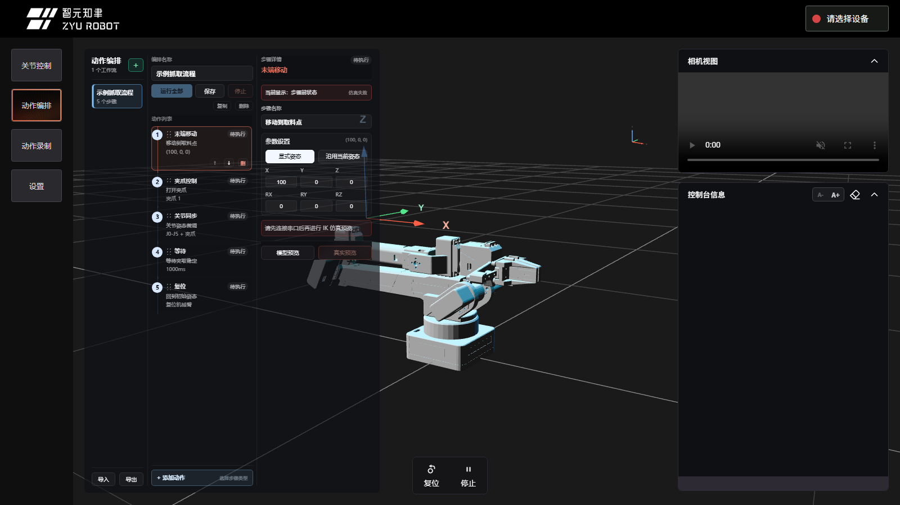
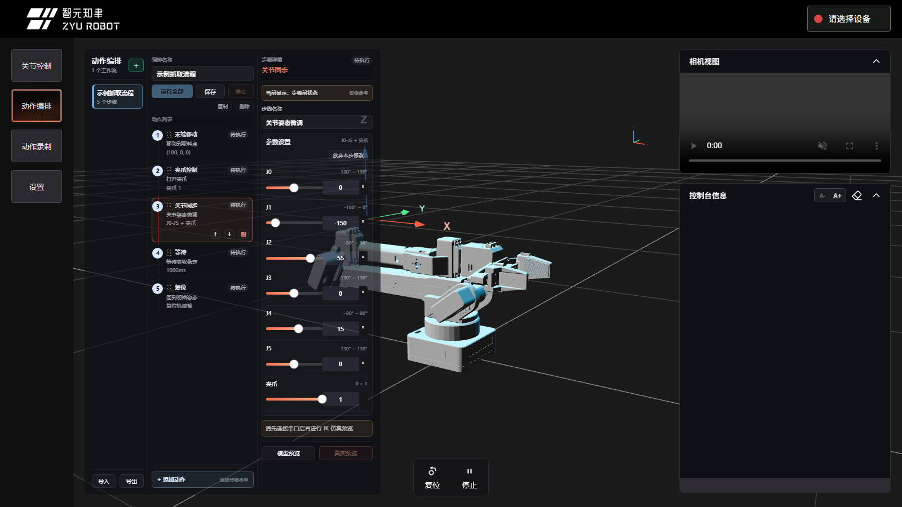

# Web 接入

Web 控制台是 ZYArm-X1 的浏览器端可视化和真机控制入口。学习者可以在网页中观察 3D 模型、连接本地串口、做关节控制、动作录制、动作编排、设备设置和基础排障。

官方 Web 控制台地址：

```text
https://arm.zyairobot.com/#/zy
```

本文说明如何通过官网 Web 控制台连接真实机械臂、完成页面操作，并理解它和底层固件协议之间的关系。

## 先理解边界

使用官方 Web 控制台时，页面会通过浏览器的 Web Serial 能力连接本地机械臂串口。页面打开成功不等于机械臂已经可控；只要要控制真实机械臂，仍然需要机械臂上电、USB 串口可见、浏览器支持 Web Serial、串口未被其他程序占用，并且动作前确认安全空间。

点击“发送到机械臂”“真实预览”“运行全部”“复位”“停止”等操作会真实发送指令。拖动滑块、填写草稿和模型预览只更新网页模型。

## 功能总览


| 区域 | 功能 |
| --- | --- |
| 左侧功能选项卡 | 切换关节控制、动作编排、动作录制、设置 |
| 中间 3D 场景 | 显示机械臂模型、网格地面和 XYZ 坐标提示 |
| 关节控制面板 | 调整关节草稿、模型预览、发送到机械臂、放弃修改 |
| 右侧相机视图 | 预留摄像头画面区域 |
| 右侧控制台信息 | 显示用户命令、ACK、错误和调试输出 |
| 顶部设备区 | 连接/断开串口、显示设备状态、执行硬件重启 |
| 底部安全按钮 | 复位、停止 |

## 使用官方在线 Web

1. 使用 Chrome 或 Edge 打开：

```text
https://arm.zyairobot.com/#/zy
```

2. 给机械臂上电，并用 USB 数据线连接电脑。
3. 确认系统能看到机械臂串口，例如 Windows 下的 `COM5`。
4. 点击页面右上角“请选择设备”。
5. 在浏览器弹出的串口选择窗口中选择机械臂串口。
6. 右上角显示“设备已连接”后，再进行真机操作。


连接失败时，优先检查浏览器、HTTPS、Web Serial 权限、CH340 驱动、USB 数据线、机械臂上电和串口占用。

## 串口连接与设备状态

点击右上角“请选择设备”后，浏览器会弹出串口选择窗口。选择机械臂对应串口，例如 Windows 下的 `COM5`。

连接成功后：

- 右上角显示“设备已连接”。
- 页面会读取机械臂状态并更新设备显示。
- 如果状态读取失败，设备区会显示异常提示。

已连接时再次点击设备状态，会弹出确认窗口，确认后断开串口并释放端口。

## 关节控制

关节控制页把“网页模型预览”和“真实机械臂执行”分开：

1. 拖动滑块，只更新页面草稿和 3D 模型。
2. 点击“发送到机械臂”，才会通过固件同步命令驱动真实机械臂。
3. 点击“放弃修改”，会用最近一次真实机械臂状态恢复滑块和模型。


这种机制适合教学：学习者可以先尝试不同关节角度，确认不会碰撞后再发送。


## 动作编排



动作编排用于创建线性工作流。它支持：

- 末端移动。
- 关节同步。
- 夹爪控制。
- 等待。
- 复位。
- 播放录制动作。
- 嵌套执行另一个编排。
- 导入/导出项目文件。

中间列负责步骤列表和排序，右侧参数列负责编辑当前步骤。动作步骤可以拖动排序；排序改变后，Web 会重新计算每个步骤对应的仿真状态。



关节同步和夹爪控制使用与关节控制页一致的滑块。末端移动可以选择“显式姿态”或“沿用当前姿态”。模型预览使用固件 IK 求解命令，不驱动真实机械臂；真实预览和运行全部会弹出确认并真实执行。

详细使用方法见 [Web 动作编排工作流](../../05_常用玩法/07_Web动作编排工作流.md)。

## 动作录制


动作录制页会在连接设备后自动读取固件中的录制清单。页面支持：

- 创建动作录制，并输入动作名称。
- 开始录制。
- 停止并保存动作。
- 删除指定动作。
- 删除全部动作。
- 录制满 3 个时提示先删除旧动作。

动作名称在 Web 侧限制为 ASCII 字母、数字和下划线，便于与固件存储和串口命令保持一致。动作录制失败时，以页面提示和控制台信息为准。

## 设置


设置页用于查看和维护设备信息：

- 机械臂名称：用于区分多台设备，可编辑、保存或取消。
- 版本信息：分为硬件版本、软件版本和编译日期。
- 维护操作：设置零位、电机下电。
- 高级参数：查看和修改关节运动速度。

设置页顶部的“刷新”会重新读取名称、版本和速度。涉及写入配置的操作会弹出确认，避免误改。

## 控制台信息

右侧终端用于学习和排障：

- 用户主动命令会显示发送、ACK、成功或失败。
- 动作编排真实预览和运行全部会显示步骤上下文。
- 当 Web 命令或终端命令正在执行时，另一个命令会短暂等待；若仍忙，会提示稍后再试。
- 终端支持 `A-` / `A+` 调整字体大小。

手动输入 `help`、`[CMD][6]` 等命令时，请等待输出结束再输入下一条。运动中需要中断时，应优先点击页面底部“停止”。

## 硬件重启

顶部右侧的“重启”按钮通过串口 DTR/RTS 控制线触发控制板硬件复位：

1. 确认串口已连接。
2. 用户点击“重启”并确认。
3. Web 暂停当前命令状态。
4. 切换 DTR/RTS 触发复位。
5. 等待约 3000ms 给固件重新启动。
6. 恢复状态同步。

它适合固件状态异常、普通停止/复位无效、但串口仍能保持连接的场景。若硬件重启后仍无法读取状态，请重新插拔 USB 或检查供电。

## 与底层协议的关系

Web 控制台不是绕过固件直接控制舵机，而是把用户操作转换为固件串口命令。常见对应关系如下：

| 页面操作 | 典型固件指令 |
| --- | --- |
| 复位 | `CMD1` |
| 停止 | `CMD2` |
| 关节同步 | `CMD3` |
| 状态同步 | `CMD6` |
| 夹爪控制 | `CMD8` |
| 速度设置 | `CMD11` |
| 开始动作录制 | `CMD13` |
| 播放录制动作 | `CMD14` |
| 停止并保存录制 | `CMD15` |
| 动作录制清单 | `CMD16` |
| 删除录制动作 | `CMD19` |
| 只 IK 求解不运动 | `CMD37` |

想查看完整协议，请阅读 [串口指令格式与回包](../../04_基础操作/01_串口指令格式与回包.md)。

## 官网不可用时

如果官方 Web 控制台暂时无法访问，建议使用下面的备用路线：

1. 先检查网络、DNS、代理和浏览器。
2. 使用串口工具完成 `CMD6` 状态读取、`CMD1` 复位和小幅动作验证。
3. 如果已经准备好 Python 环境，使用 Python SDK 或 tools 做状态读取和复位。
4. 记录页面提示、浏览器版本、网络环境和设备状态，反馈给项目方。

## 常见问题

| 现象 | 处理建议 |
| --- | --- |
| 官方 Web 打不开 | 检查网络、代理和现场网络策略；短期内切换串口工具或 SDK 备用路线 |
| 页面可打开但不能连接串口 | 使用 Chrome/Edge，关闭其他串口软件 |
| 连接后提示异常 | 检查机械臂上电、USB 线和固件状态 |
| 设备状态显示异常 | 检查机械臂上电、USB 线、串口占用和固件状态 |
| 动作编排真实预览失败 | 查看右侧终端的步骤上下文和固件 ACK |
| 动作录制列表为空 | 先确认设备已连接，再点击刷新 |
| 关节滑块动了但真机没动 | 需要点击“发送到机械臂” |
| 停止后仍显示忙 | 等待固件返回完成；若异常可尝试硬件重启或直接断电 |
