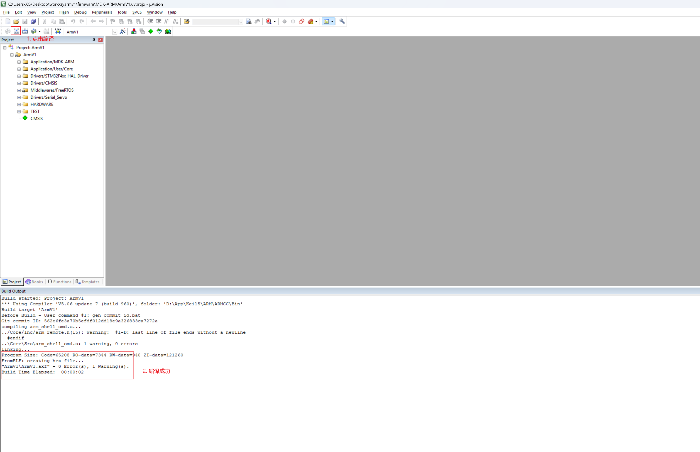
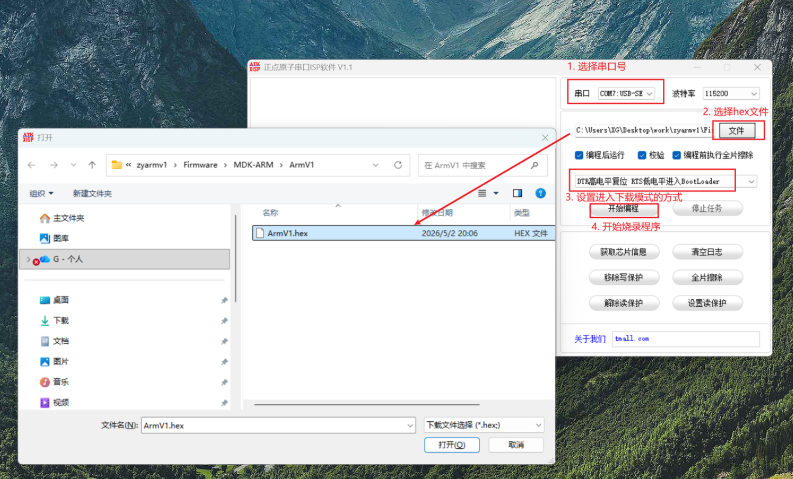
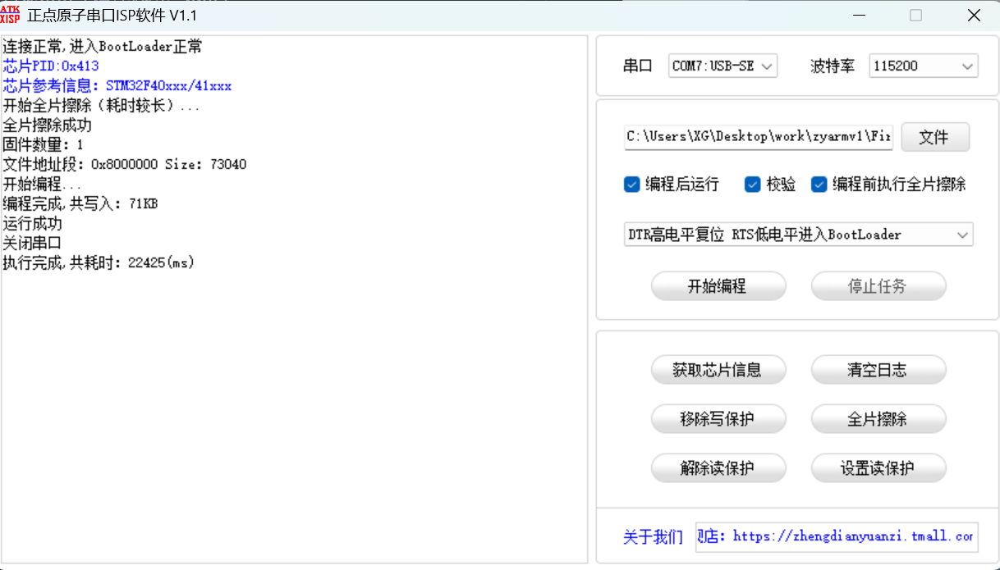
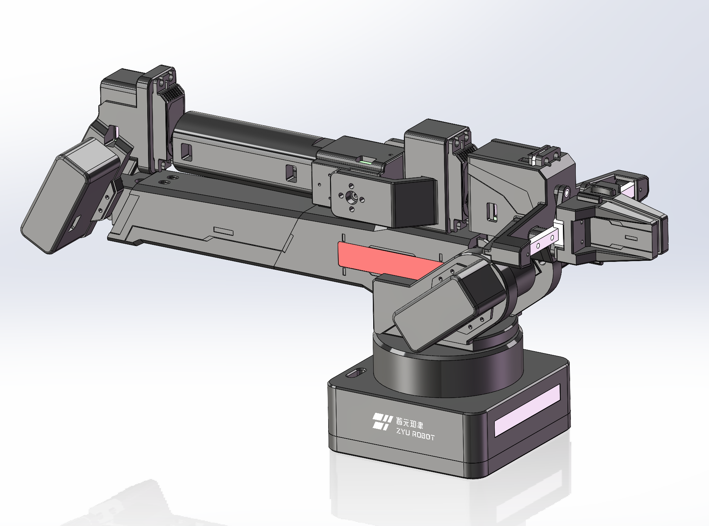
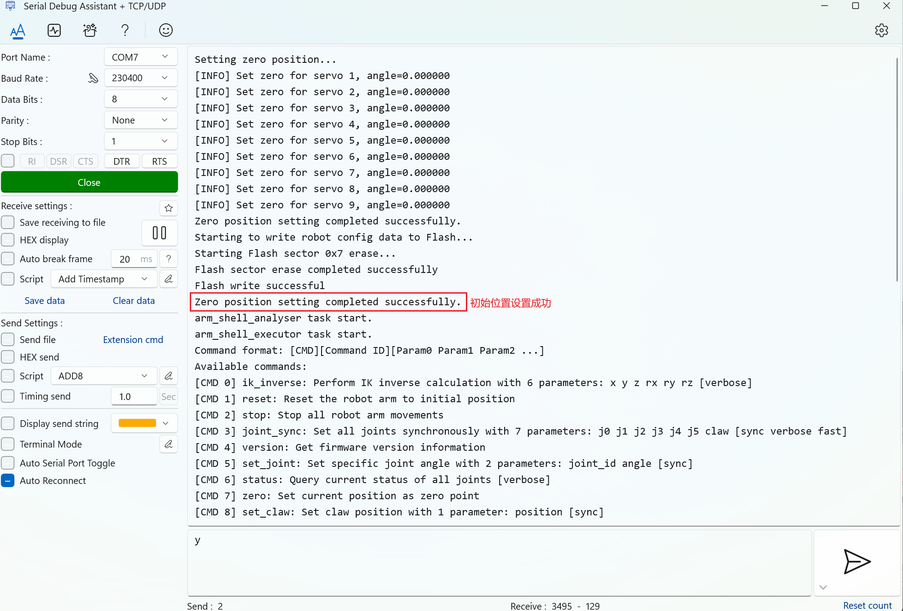

# 编译与烧录

本页说明固件从源码到控制板的基本路径。安装 Keil、Pack 和 ATK-XISP 的前置步骤见 [固件开发环境](../../03_安装与准备/05_固件开发环境.md)。

## 编译流程

1. 用 Keil 打开 `firmware/MDK-ARM/ArmV1.uvprojx`。
2. 执行 Build。
3. 确认 Build Output 中为 `0 Error(s)`。
4. 查看输出目录 `firmware/MDK-ARM/ArmV1/`。

常见编译产物：

| 产物 | 用途 |
| --- | --- |
| `ArmV1.hex` | 常用烧录文件 |
| `ArmV1.axf` | 调试和符号信息 |
| `ArmV1.map` | 查看链接结果、内存占用和符号 |
| `ArmV1.build_log.htm` | 编译日志 |

如果只是交付给用户烧录，通常优先使用 `.hex`。如果要调试定位问题，`.axf` 和 `.map` 更有价值。



上图用于确认 Keil 工程已经完成一次基础编译。只要能看到 `0 Error(s)`，构建耗时、固件大小和 warning 数量可以和截图不同。

## 烧录流程

ATK-XISP 是串口烧录工具，用于把 Keil 编译生成的 `.hex` 文件写入控制板。这里的烧录波特率是 `115200`，和机械臂运行时串口控制使用的 `230400` 不同。

1. 打开 [ATK-XISP](http://www.openedv.com/docs/tool/ruanjian/ATK-XISP.html)。
2. 选择控制板对应的串口号。
3. 将波特率设置为 `115200`。
4. 点击 `文件`，选择 `firmware/MDK-ARM/ArmV1/ArmV1.hex`。
5. 将进入下载模式的方式设置为 `DTR高电平复位 RTS低电平进入BootLoader`。
6. 点击 `开始编程`，等待烧录完成。





上面两张图分别用于核对烧录文件选择和烧录成功提示。烧录时使用的是下载工具中的 `115200`，不要和运行时串口控制的 `230400` 混淆。

如果烧录失败，先检查串口是否选对、串口是否被其他软件占用、控制板是否正常上电，再重新尝试烧录。

## 烧录后首次启动

烧录后第一次启动时，如果固件没有从 Flash 中读取到有效的机械臂配置，会通过串口提示设置初始姿态。这个步骤用于建立机械臂的零位基准，不是普通的动作控制流程。

操作前先确认机械臂周围没有障碍物，并且你知道如何快速断电。

1. 打开机械臂电源。
2. 打开串口软件，连接机械臂运行时串口，参数使用 `230400, 8N1, no flow control`。
3. 将机械臂摆放到项目推荐的初始姿态。



上图用于对照烧录后首次启动时的推荐初始姿态。确认周围没有障碍物后，再继续写入零位基准。

4. 确认姿态已经调整完成后，在串口软件中发送 `y` 或 `Y`。
5. 看到设置成功提示后，再继续进行烧录后验证。



上图用于确认初始姿态已经写入成功。看到成功提示后，再进入后续的串口命令验证。

## 烧录后验证

最低验证建议：

- 串口参数仍为 `230400, 8N1, no flow control`。
- 能看到 `help` 输出。
- `CMD4` 返回版本信息。
- `CMD22` 返回机械臂名称，方便区分多台设备。
- `CMD6` 返回 `[STATUS]`。
- `CMD1` 复位动作正常。
- 修改过的命令可以返回预期 ACK 或响应。
- 如果改动影响 SDK，运行对应 SDK 测试或工具脚本。

可以按下面顺序在串口软件中确认：

```text
help
[CMD][4]
[CMD][22]
[CMD][6]
[CMD][1]
```

如果要同时记录名称、版本等信息，也可以使用工具脚本：

```bash
python software/tools/get_arm_info.py --port COM3
```

Linux 下把 `COM3` 换成实际串口，例如 `/dev/ttyUSB0`。
